---
# Front matter
lang: ru-RU
title: Защита лабораторной работы №1. Установка и конфигурация операционной системы на виртуальную машину
author: "Исаханян Эдуард Тигранович"
group: NFIbd-01-19
institute: RUDN University, Moscow, Russian Federation
date: 2022 Sep 10th

# Formatting
toc: false
slide_level: 2
theme: metropolis
header-includes: 
 - \metroset{progressbar=frametitle,sectionpage=progressbar,numbering=fraction}
 - '\makeatletter'
 - '\beamer@ignorenonframefalse'
 - '\makeatother'
aspectratio: 43
section-titles: true

---

# Защита лабораторной работы №1  

# Цель  
Приобретение практических навыков установки операционной системы на виртуальную машину, 
настройки минимально необходимых для дальнейшей работы сервисов.

# Задачи
В ходе работы мы должны:
1. Установить операционную систему на вирутальную машину VirtualBox;
2. Настройка минимальных для работы сервисов.

# Создание виртуальной машины

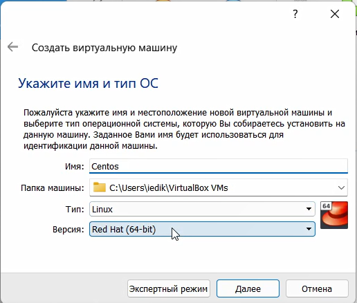{ #fig:001 width=70% }

## Размер оперативной памяти

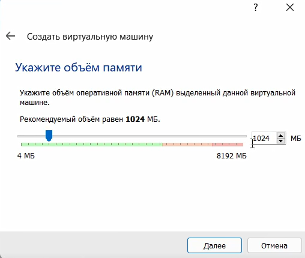{ #fig:002 width=70% }

## Новый жетский диск

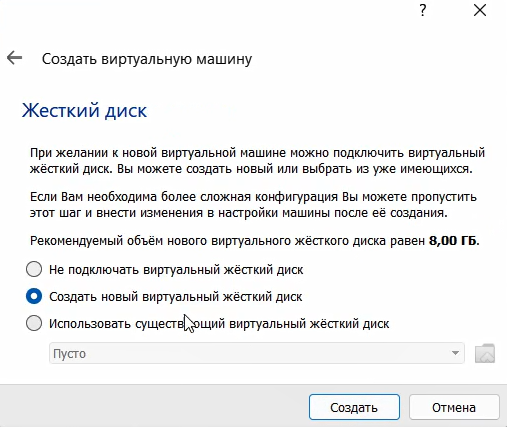{ #fig:003 width=70% }

## Тип Диска 

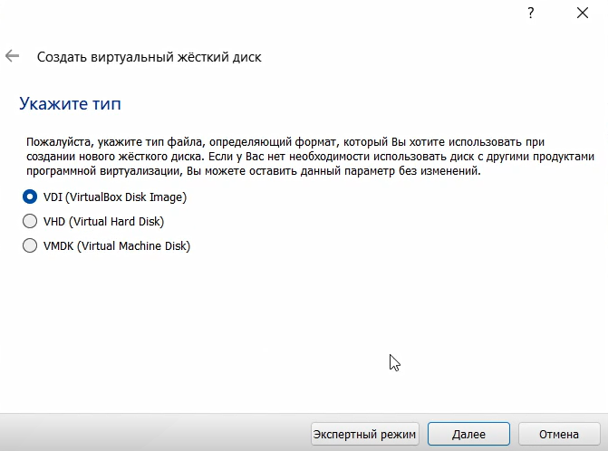{ #fig:004 width=70% }

## Формат диска

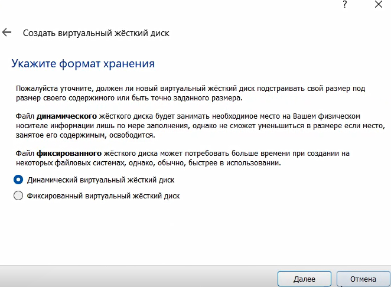{ #fig:005 width=70% }

## Размер и расположение

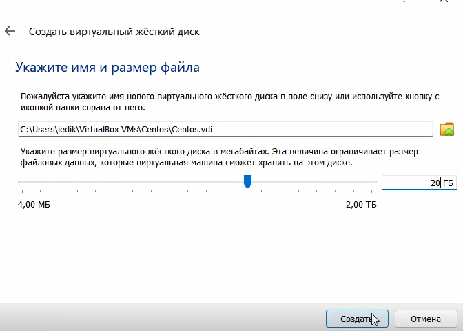{ #fig:006 width=70% }

## Установление образа

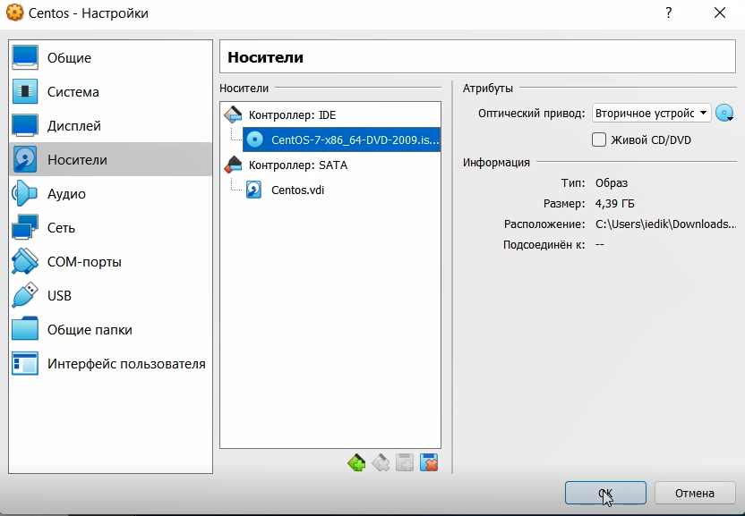{ #fig:007 width=70% }

## Запуск и установка системы

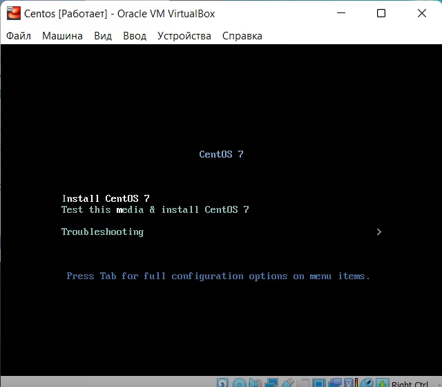{ #fig:008 width=70% }

## Установление языка

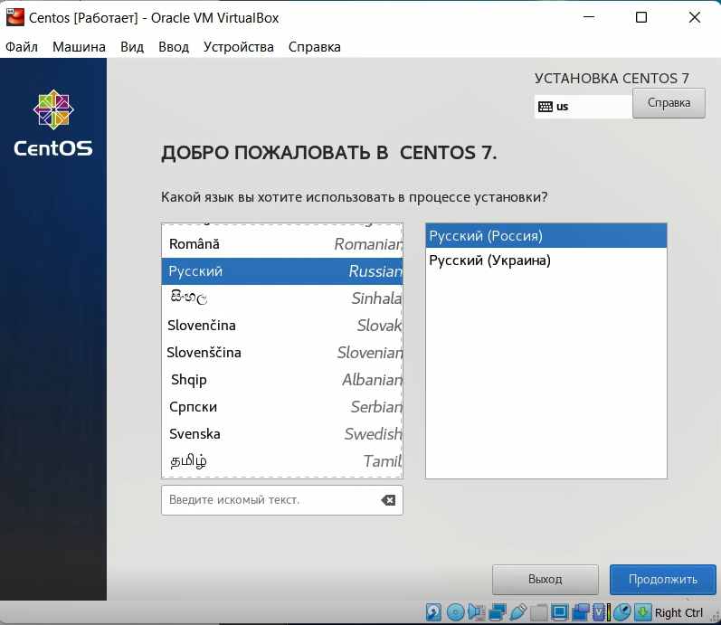{ #fig:009 width=70% }

## Установка часового пояса

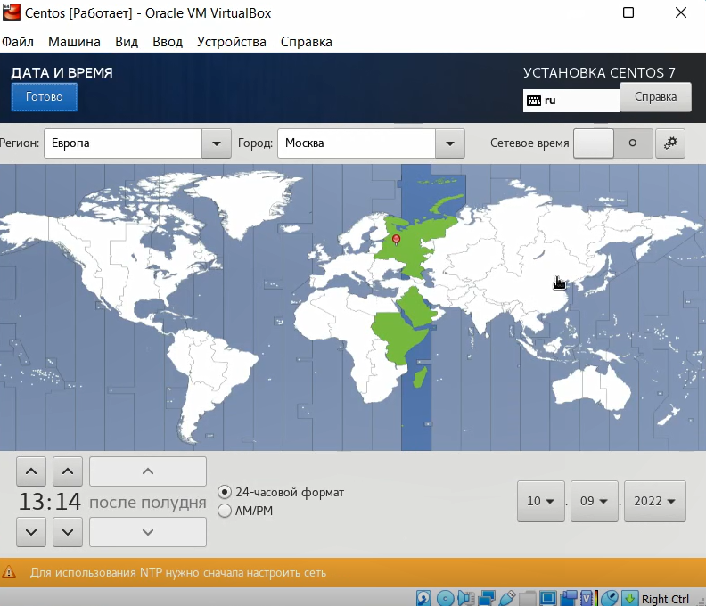{ #fig:010 width=70% }

## Выбор программ

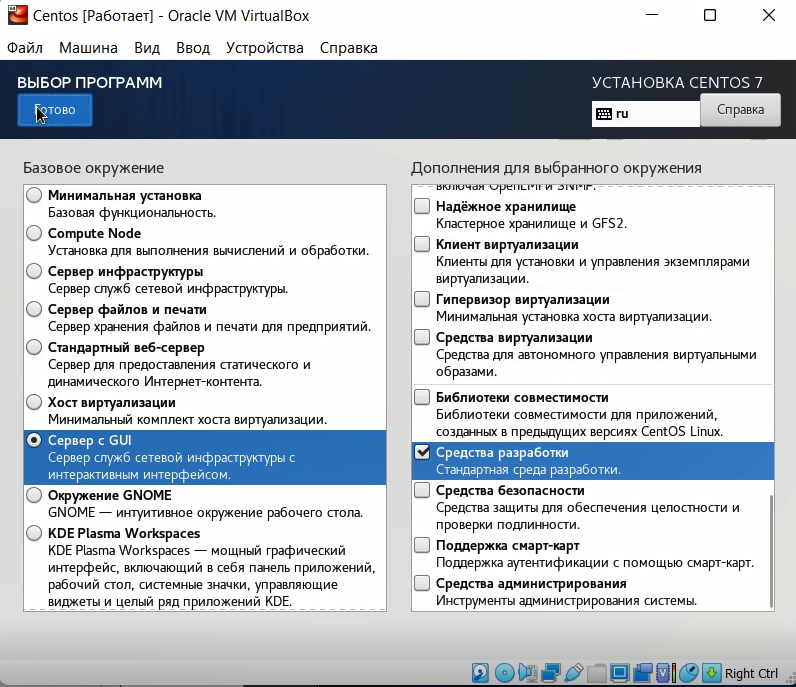{ #fig:011 width=70% }

## Указание сетевого имени

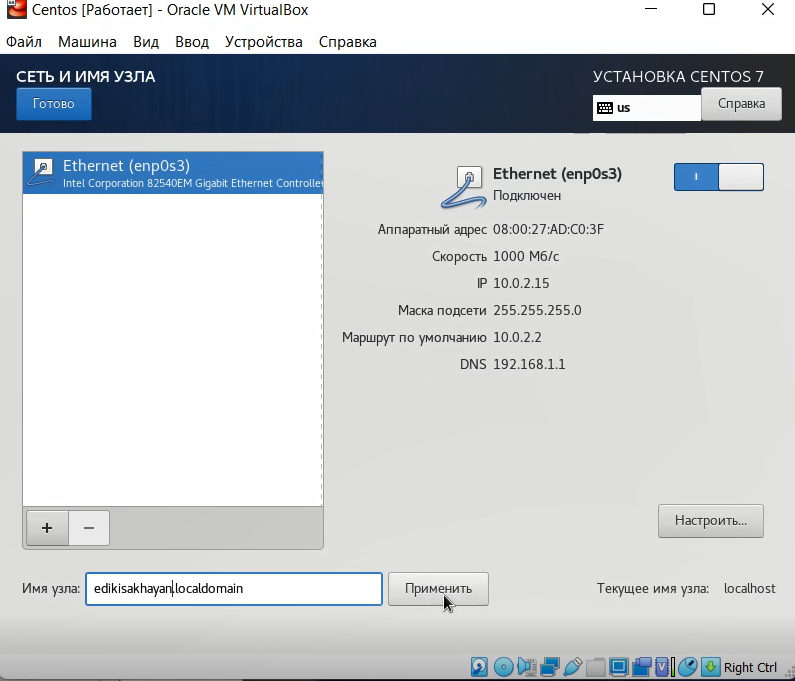{ #fig:012 width=70% }

## Отключение KDUMP

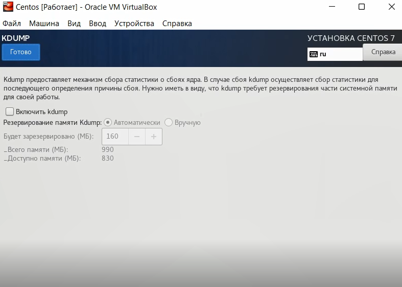{ #fig:013 width=70% }

## Установка пароля для root

{ #fig:014 width=70% }

## Создание пользователя

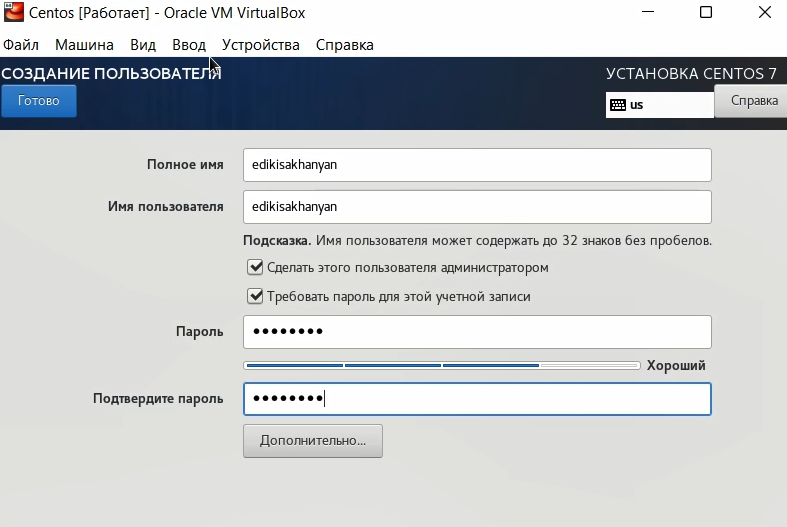{ #fig:015 width=70% }

## Принятие лицензии

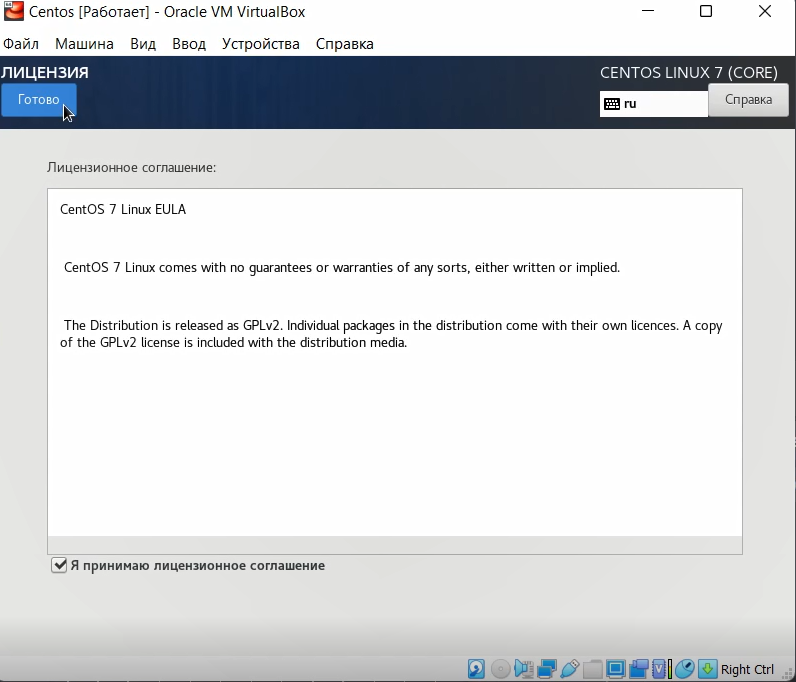{ #fig:016 width=70% }

## Драйвера

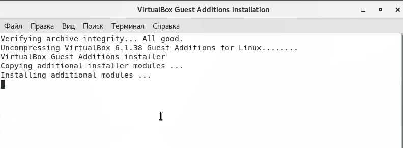{ #fig:017 width=70% }

# Вывод   

Входе работы, мы приобрели практические навыки установки операционной
системы на виртуальную машину, настройки минимально необходимых для
дальнейшей работы сервисов.

