---
# Front matter
title: "Отчет по лабораторной работе №1"
subtitle: "Установка и конфигурация операционной системы на виртуальную машину"
author: "Исаханян Эдуард Тигранович"
group: NFIbd-01-19
institute: RUDN University, Moscow, Russian Federation
date: 2022 Sep 10th

# Generic otions
lang: ru-RU
toc-title: "Содержание"

# Bibliography
bibliography: bib/cite.bib
csl: pandoc/csl/gost-r-7-0-5-2008-numeric.csl

# Pdf output format
toc: true # Table of contents
toc_depth: 2
lof: true # List of figures
lot: true # List of tables
fontsize: 12pt
linestretch: 1.5
papersize: a4
documentclass: scrreprt
### Fonts
mainfont: PT Serif
romanfont: PT Serif
sansfont: PT Sans
monofont: PT Mono
mainfontoptions: Ligatures=TeX
romanfontoptions: Ligatures=TeX
sansfontoptions: Ligatures=TeX,Scale=MatchLowercase
monofontoptions: Scale=MatchLowercase,Scale=0.9
## Biblatex
biblatex: true
biblio-style: "gost-numeric"
biblatexoptions:
- parentracker=true
- backend=biber
- hyperref=auto
- language=auto
- autolang=other*
- citestyle=gost-numeric
## Misc options
indent: true
header-includes:
- \linepenalty=10 # the penalty added to the badness of each line within a paragraph (no associated penalty node) Increasing the value makes tex try to have fewer lines in the paragraph.
- \interlinepenalty=0 # value of the penalty (node) added after each line of a paragraph.
- \hyphenpenalty=50 # the penalty for line breaking at an automatically inserted hyphen
- \exhyphenpenalty=50 # the penalty for line breaking at an explicit hyphen
- \binoppenalty=700 # the penalty for breaking a line at a binary operator
- \relpenalty=500 # the penalty for breaking a line at a relation
- \clubpenalty=150 # extra penalty for breaking after first line of a paragraph
- \widowpenalty=150 # extra penalty for breaking before last line of a paragraph
- \displaywidowpenalty=50 # extra penalty for breaking before last line before a display math
- \brokenpenalty=100 # extra penalty for page breaking after a hyphenated line
- \predisplaypenalty=10000 # penalty for breaking before a display
- \postdisplaypenalty=0 # penalty for breaking after a display
- \floatingpenalty = 20000 # penalty for splitting an insertion (can only be split footnote in standard LaTeX)
- \raggedbottom # or \flushbottom
- \usepackage{float} # keep figures where there are in the text
- \floatplacement{figure}{H} # keep figures where there are in the text
---

# Цель работы

Приобретение практических навыков установки операционной системы на виртуальную машину, настройки минимально необходимых для дальнейшей работы сервисов.

# Задание
В ходе работы мы должны:  
1. Установить операционную систему на вирутальную машину VirtualBox;  
2. Настройка минимальных для работы сервисов.

# Теоретическое введение  

Linux (Линукс) — это целое семейство операционных систем Unix с открытым исходным кодом, основанных на ядре Linux. Сюда входят все самые популярные системы на основе ОС, например: Ubuntu, Fedora, CentOS и другие. Их ещё называют дистрибутивами.

Дистрибутив (distribute) — форма распространения программного обеспечения. В данном случае, форма распространения операционной системы Linux.

Операционная система CentOS (сокращенно от английского «Community ENTerprise Operating System») — дистрибутив Linux, основанный на коммерческом дистрибутиве Red Hat Enterprise Linux компании Red Hat, который предназначен для корпоративного использования. Срок поддержки каждой версии CentOS составляет 10 лет. И хоть ОС разработана энтузиастами, но каждая версия обновляется каждые полгода.

# Выполнение лабораторной работы

Откровем VirtualBox и создадим виртуальную машину с операционной сисемой Linux(рис. [-@fig:001]).

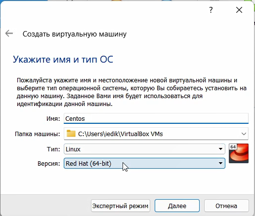{ #fig:001 width=70% }

Укажем размер основной памяти виртуальной машины — 1024 МБ(рис. [-@fig:002]).

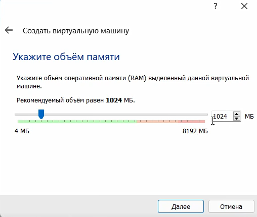{ #fig:002 width=70% }

Создадим новый виртуальный жесткий диск и зададим конфигурацию жесткого диска — загрузочный, VDI (VirtualBox 
Disk Image), динамический виртуальный диск. Зададим размер диска — 20 ГБ и его расположение(рис. [-@fig:003] - [-@fig:006]).

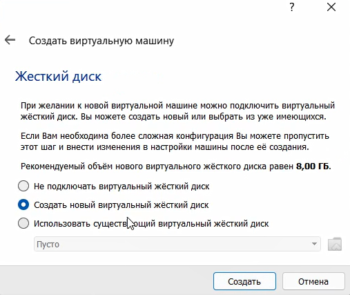{ #fig:003 width=70% }

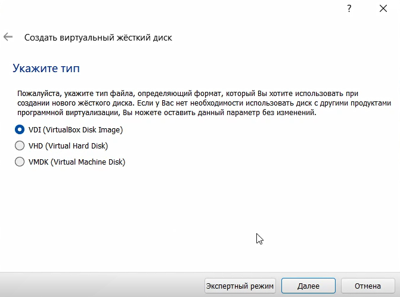{ #fig:004 width=70% }

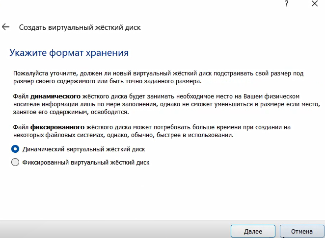{ #fig:005 width=70% }

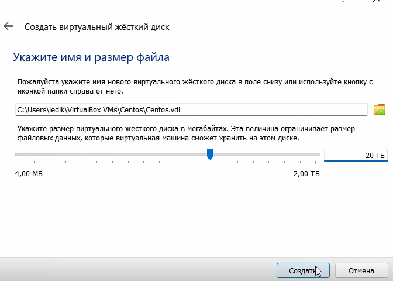{ #fig:006 width=70% }

Добавим новый привод оптических дисков и выберем нужный образ(рис. [-@fig:007]).

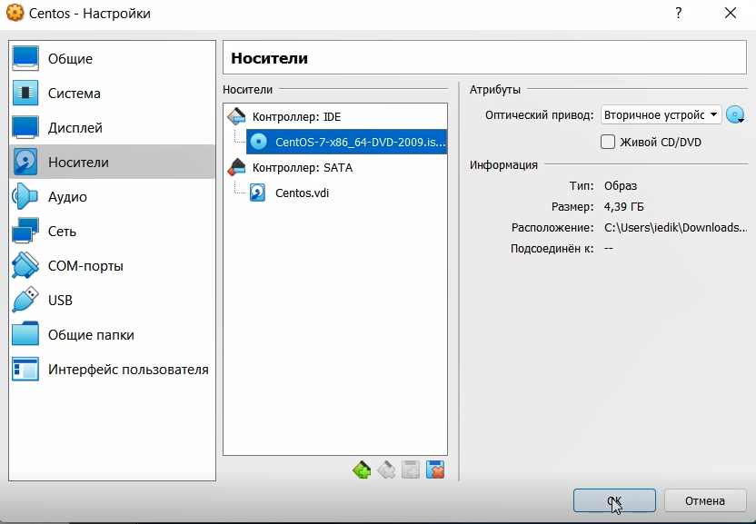{ #fig:007 width=70% }

Запустим виртуальную машину Centos и установим систему (рис. [-@fig:008]).

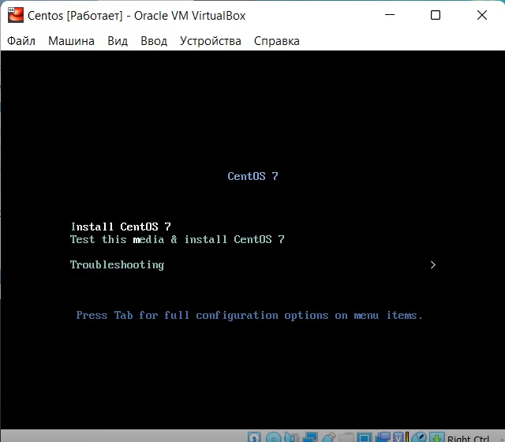{ #fig:008 width=70% }

Установим русский язык по умолчанию (рис. [-@fig:009]).

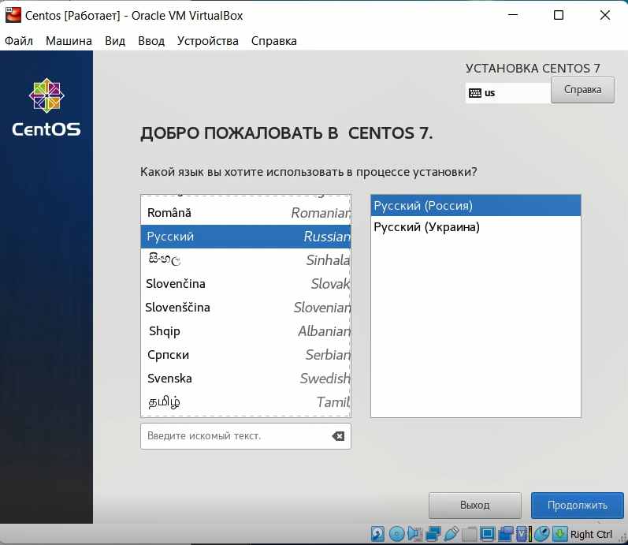{ #fig:009 width=70% }

Укажем часовой пояс «Москва» (рис. [-@fig:010]).

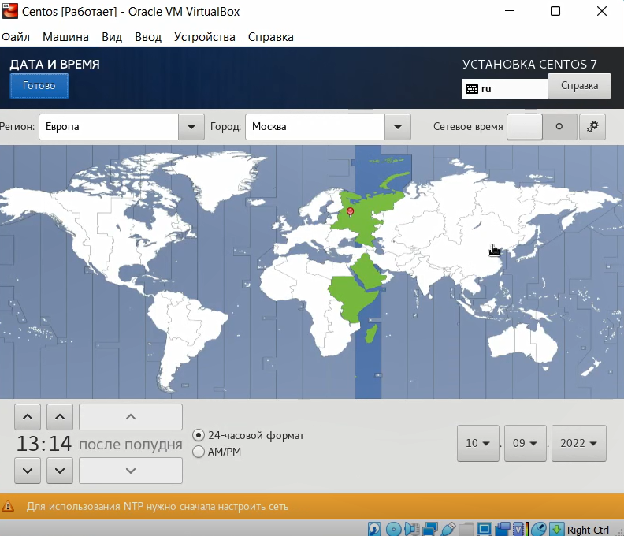{ #fig:010 width=70% }

Установим сервер с GUI и средства разработки (рис. [-@fig:011]).

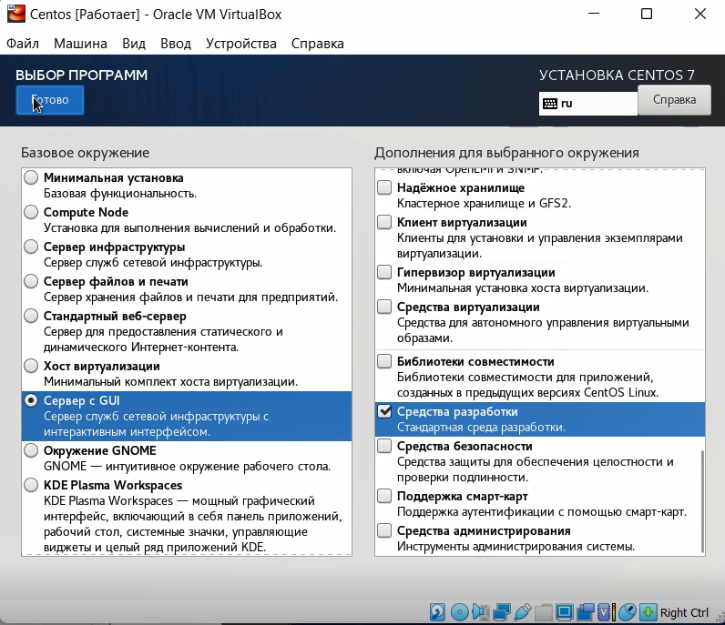{ #fig:011 width=70% }

В качестве имени машины укажем «edikisakhanyan.localdomain» (рис. [-@fig:012]).

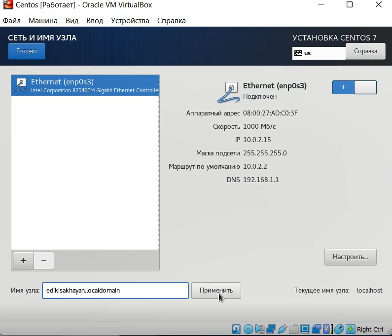{ #fig:012 width=70% }

Отключим KDUMP (рис. [-@fig:013]).

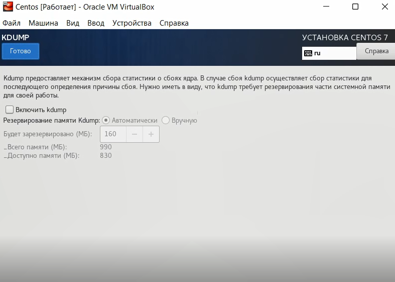{ #fig:013 width=70% }

Установим пароль для root (рис. [-@fig:014]).

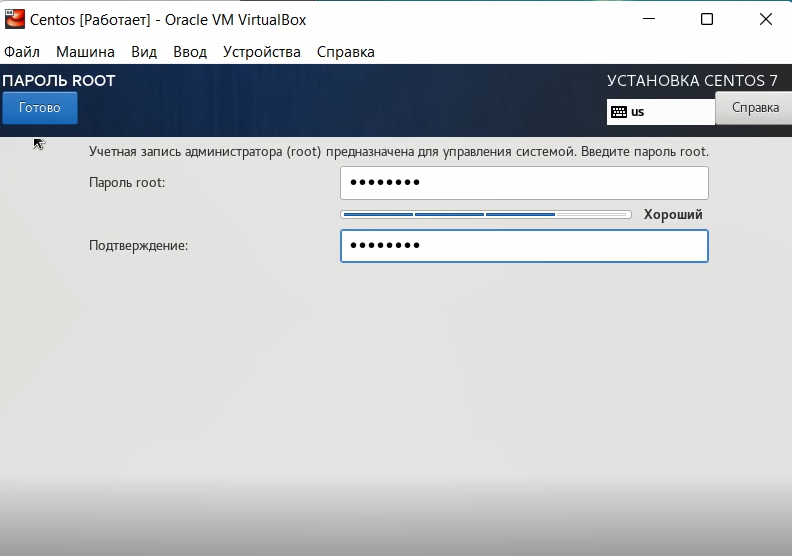{ #fig:014 width=70% }

Создадим пользователя (рис. [-@fig:015]).

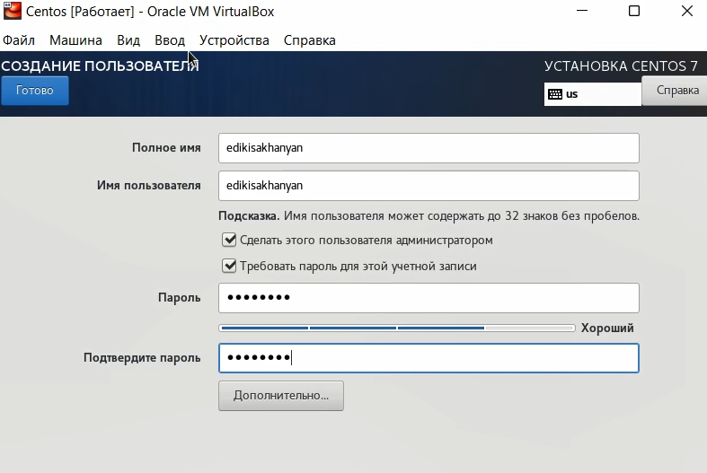{ #fig:015 width=70% }

После установки примем лицензию (рис. [-@fig:016]).

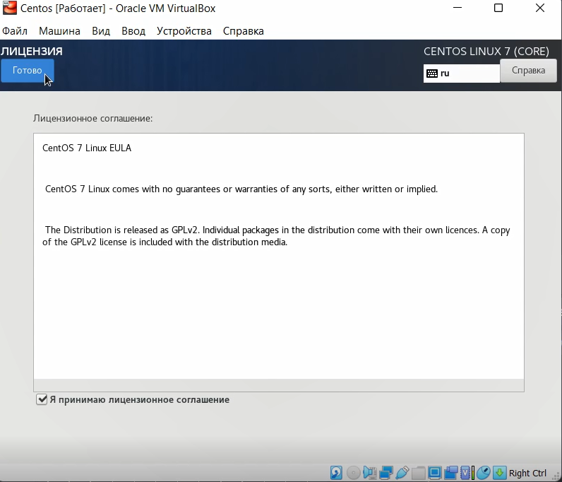{ #fig:016 width=70% }

Установим необходимые драйвера (рис. [-@fig:017]).

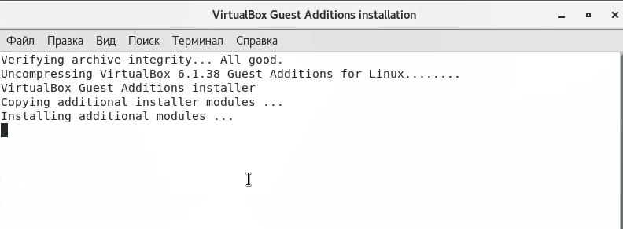{ #fig:017 width=70% }

Посмотрим всю информацию (рис. [-@fig:018] - [-@fig:019]).

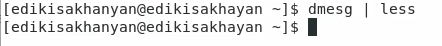{ #fig:018 width=70% }

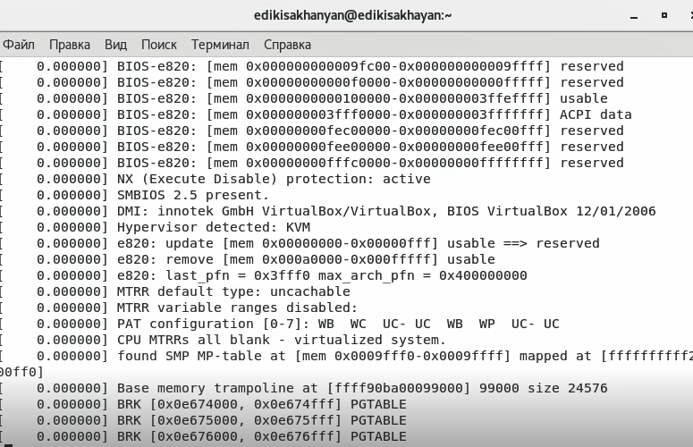{ #fig:019 width=70% }

С помощью команды grep -i " " найдем информацию на:
- Версию ядра Linux (Linux version)(рис. [-@fig:020]).

   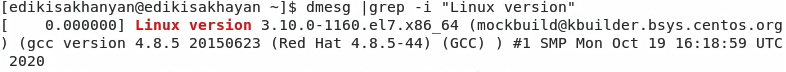{ #fig:020 width=70% }

- Частоты процессора (Detected Mhz processor) и тип обнаруженного гипервизора (Hypervisor detected)(рис. [-@fig:021]).

  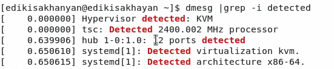{ #fig:021 width=70% }

- Модель процессора (CPU0)(рис. [-@fig:022]).

  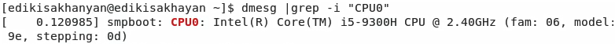{ #fig:022 width=70% }

- Объем доступной оперативной памяти (Memory available)(рис. [-@fig:023]).

  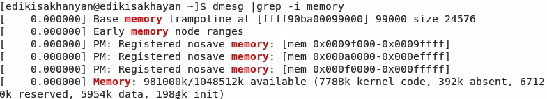{ #fig:023 width=70% }

- Тип файловой системы корневого раздела(рис. [-@fig:024]).

  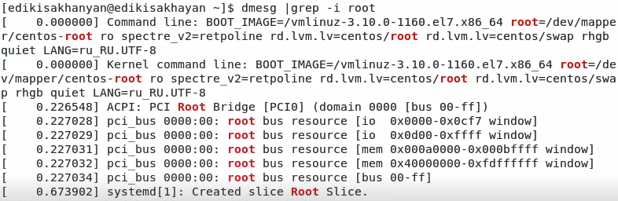{ #fig:024 width=70% }

- Последовательность монтирования файловых систем(рис. [-@fig:024]).

  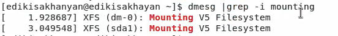{ #fig:025 width=70% }

# Контрольные вопросы[^1]

1. Какую информацию содержит учётная запись пользователя?
   Учётная запись содержит данные о пользователе, необходимые для регистрации в системе и дальнейшей работы с ней.  

2. Укажите команды терминала и приведите примеры:  
   - для получения справки по команде:  
     Чтобы получить справку по команде, введите man перед ней, например, man bash выдаст руководство по терминалу.  
   
   - для перемещения по файловой системе:  
      Чтобы перемещаться ао файловой системе использкют команду cd, например cd/user/Загрузки.  
   
   - для просмотра содержимого каталога:  
     Команда ls позволяет просмотреть содержимое каталога.  
   
   - для определения объёма каталога:  
      Чтобы посмотреть объем каталога используют команду du -s,
      например du -s /home/user/Загрузки.  
   
   - для создания / удаления каталогов / файлов:  
      Чтобы создать каталог используется команда rmdir, а для 
      создания mkdir, для удаления файла rm, а для создания файла touch.  
   
   - для задания определённых прав на файл / каталог:  
      Для задания определенных прав на файл/каталог используют
      команду chmod.  
   
   - для просмотра истории команд:  
      Чтобы посмотреть историю команд используют команду history,
      например history -c очищает историю команд.  
   
3. Что такое файловая система?
   Файловая система (ФС) — архитектура хранения данных, которые могут находиться в разделах жесткого диска и ОП. Выдает пользователю доступ к конфигурации ядра. Определяет, какую структуру принимают файлы в каждом из разделов, создает правила для их генерации, а также управляет файлами в соответствии с особенностями каждой конкретной ФС.  

4. Как посмотреть, какие файловые системы подмонтированы в ОС?
   Чтобы посмотреть какие файловые системы уже смонтированы в системе можно выполнить команду mount без параметров или выполнить команду df -a. Также можно посмотреть содержимое файла /etc/mtab. Команда mount при монтировании новой файловой системы добавляет в этот файл строку с информацией о добавляемой системе. А команда umount соответственно удаляет строку касающуюся отмонтированного раздела.  

5. Как удалить зависший процесс?
    Чтобы убить зависший процесс нужно использовать команду kill. Но перед тем как убить процесс нужно использовать команду ps
    чтобы посмотреть индификатор.
   
# Выводы  
Входе работы, мы приобрели практические навыки установки операционной 
системы на виртуальную машину, настройки минимально необходимых для 
дальнейшей работы сервисов.

# Список литературы{.unnumbered}
1. Методические материалы к лабораторной работе, представленные на сайте "ТУИС РУДН" https://esystem.rudn.ru/  
::: {#refs}
:::

[^1]: Открытый источник информации