---
# Front matter
lang: ru-RU
title: Защита лабораторной работы №2. Дискреционное разграничение прав в Linux. Основные атрибуты
author: "Исаханян Эдуард Тигранович"
group: NFIbd-01-19
institute: RUDN University, Moscow, Russian Federation
date: 2022 Sep 13th

# Formatting
toc: false
slide_level: 2
theme: metropolis
header-includes: 
 - \metroset{progressbar=frametitle,sectionpage=progressbar,numbering=fraction}
 - '\makeatletter'
 - '\beamer@ignorenonframefalse'
 - '\makeatother'
aspectratio: 43
section-titles: true

---

# Защита лабораторной работы №2 

# Цель

Получение практических навыков работы в консоли с атрибутами файлов, закрепление теоретических основ дискреционного разграничения доступа в современных системах с открытым кодом на базе ОС Linux.

## Создание пользвателя guest

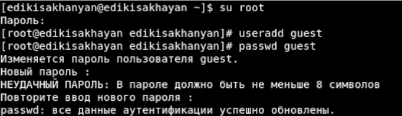{ #fig:001 width=70% }

## Проверка директории

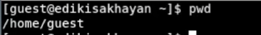{ #fig:003 width=70% }

## Проверка имени пользователя

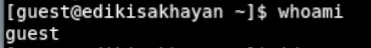{ #fig:004 width=70% }

## Проверка ID

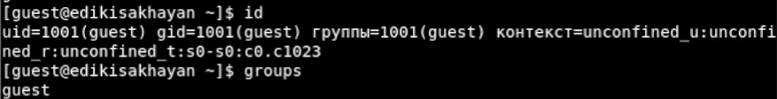{ #fig:005 width=70% }

## Файл /etc/passwd

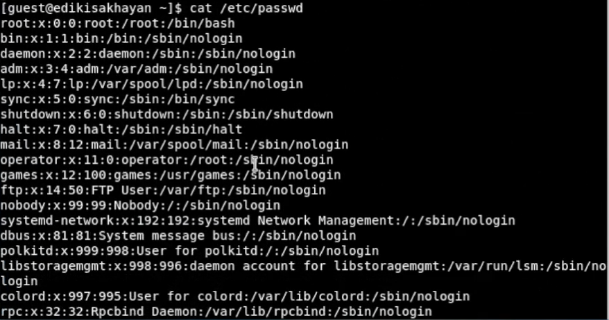{ #fig:006 width=70% }

## Существующие директории

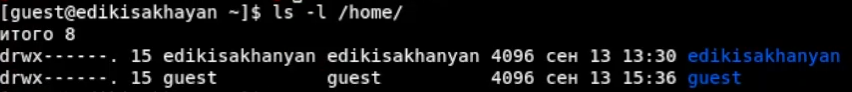{ #fig:008 width=70% }

## Расширенные атрибуты поддиректорий

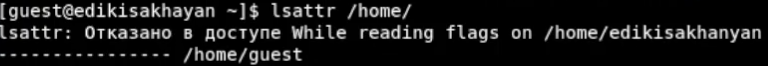{ #fig:009 width=70% }

## Поддиректория dir1

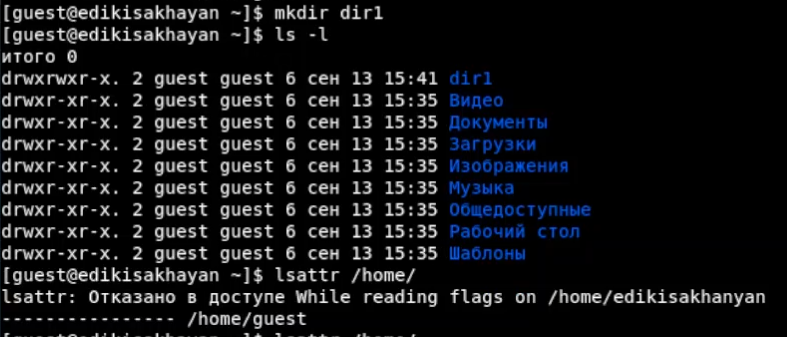{ #fig:010 width=70% }

## Расширенные атрибуты поддиректорий 

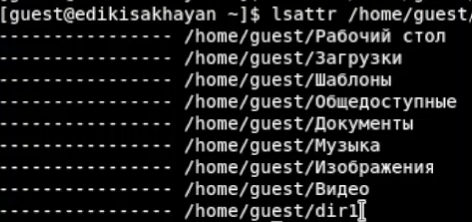{ #fig:011 width=70% }

## Снятие с директорий все атрибуты

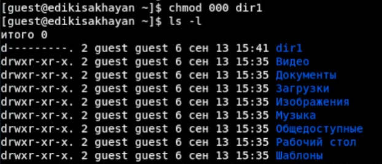{ #fig:012 width=70% }

## Попытка создать файл

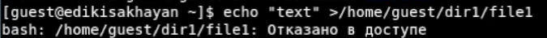{ #fig:013 width=70% }

## Установленные права и разрешённые действия 1

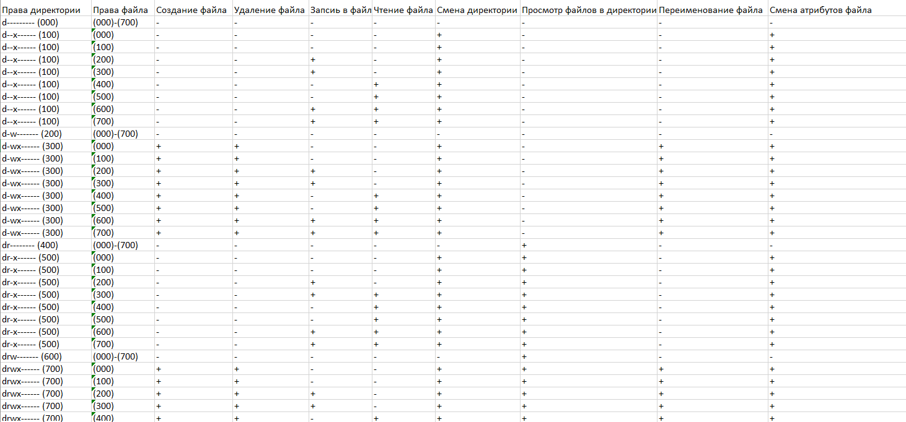{ #fig:014 width=70% }

## Установленные права и разрешённые действия 2

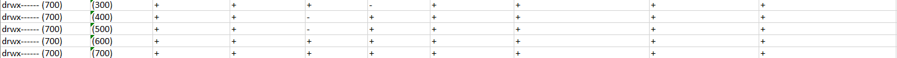{ #fig:015 width=70% }

## Минимальные права для совершения операций

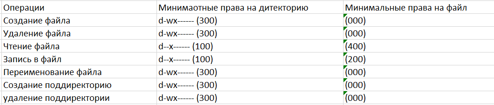{ #fig:016 width=70% }

# Вывод   

Входе работы, мы получии практические навыки работы в консоли с атрибутами файлов, закрепили
теоретические основы дискреционного разграничения доступа в современных
системах с открытым кодом на базе ОС Linux.

