---
# Front matter
title: "Отчет по лабораторной работе №2"
subtitle: "Дискреционное разграничение прав в Linux. Основные атрибуты"
author: "Исаханян Эдуард Тигранович"
group: NFIbd-01-19
institute: RUDN University, Moscow, Russian Federation
date: 2022 Sep 13th

# Generic otions
lang: ru-RU
toc-title: "Содержание"

# Bibliography
bibliography: bib/cite.bib
csl: pandoc/csl/gost-r-7-0-5-2008-numeric.csl

# Pdf output format
toc: true # Table of contents
toc_depth: 2
lof: true # List of figures
lot: true # List of tables
fontsize: 12pt
linestretch: 1.5
papersize: a4
documentclass: scrreprt
### Fonts
mainfont: PT Serif
romanfont: PT Serif
sansfont: PT Sans
monofont: PT Mono
mainfontoptions: Ligatures=TeX
romanfontoptions: Ligatures=TeX
sansfontoptions: Ligatures=TeX,Scale=MatchLowercase
monofontoptions: Scale=MatchLowercase,Scale=0.9
## Biblatex
biblatex: true
biblio-style: "gost-numeric"
biblatexoptions:
- parentracker=true
- backend=biber
- hyperref=auto
- language=auto
- autolang=other*
- citestyle=gost-numeric
## Misc options
indent: true
header-includes:
- \linepenalty=10 # the penalty added to the badness of each line within a paragraph (no associated penalty node) Increasing the value makes tex try to have fewer lines in the paragraph.
- \interlinepenalty=0 # value of the penalty (node) added after each line of a paragraph.
- \hyphenpenalty=50 # the penalty for line breaking at an automatically inserted hyphen
- \exhyphenpenalty=50 # the penalty for line breaking at an explicit hyphen
- \binoppenalty=700 # the penalty for breaking a line at a binary operator
- \relpenalty=500 # the penalty for breaking a line at a relation
- \clubpenalty=150 # extra penalty for breaking after first line of a paragraph
- \widowpenalty=150 # extra penalty for breaking before last line of a paragraph
- \displaywidowpenalty=50 # extra penalty for breaking before last line before a display math
- \brokenpenalty=100 # extra penalty for page breaking after a hyphenated line
- \predisplaypenalty=10000 # penalty for breaking before a display
- \postdisplaypenalty=0 # penalty for breaking after a display
- \floatingpenalty = 20000 # penalty for splitting an insertion (can only be split footnote in standard LaTeX)
- \raggedbottom # or \flushbottom
- \usepackage{float} # keep figures where there are in the text
- \floatplacement{figure}{H} # keep figures where there are in the text
---

# Цель работы

Получение практических навыков работы в консоли с атрибутами файлов, закрепление теоретических основ дискреционного разграничения доступа в современных системах с открытым кодом на базе ОС Linux.

# Теоретическое введение[^1]  

В Линуксе существует 3 основынх права доступа:
- Чтение - разрешает получать содержимое файла, но на запись нет. Для каталога позволяет получить список файлов и каталогов, расположенных в нем;
- Запись - разрешает записывать новые данные в файл или изменять существующие, а также позволяет создавать и изменять файлы и каталоги;
- Выполнение - вы не можете выполнить программу, если у нее нет флага выполнения. Этот атрибут устанавливается для всех программ и скриптов, именно с помощью него система может понять, что этот файл нужно запускать как программу.

Но все эти права были бы бессмысленными, если бы применялись сразу для всех пользователей. Поэтому каждый файл имеет три категории пользователей, для которых можно устанавливать различные сочетания прав доступа:

- Владелец - набор прав для владельца файла, пользователя, который его создал или сейчас установлен его владельцем. Обычно владелец имеет все права, чтение, запись и выполнение.
- Группа - любая группа пользователей, существующая в системе и привязанная к файлу. Но это может быть только одна группа и обычно это группа владельца, хотя для файла можно назначить и другую группу.
- Остальные - все пользователи, кроме владельца и пользователей, входящих в группу файла.

# Выполнение лабораторной работы

В установленной при выполнении предыдущей лабораторной работы операционной системе создим учётную запись пользователя guest (используя
учётную запись администратора) и зададим пароль (рис. [-@fig:001]).

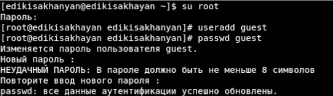{ #fig:001 width=70% }

Войдем в систему от имени пользователя guest (рис. [-@fig:002]).

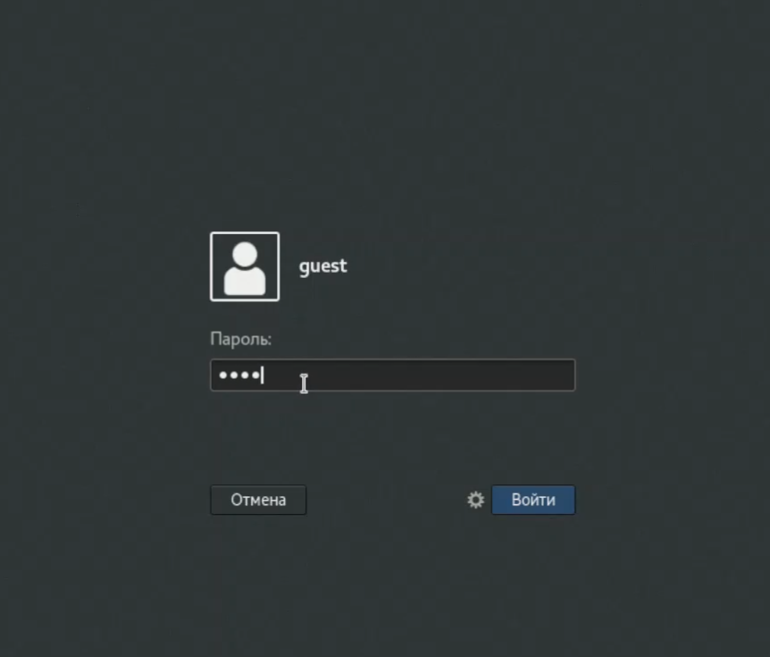{ #fig:002 width=70% }

Определим директорию, в которой мы находимся (рис. [-@fig:003]). 

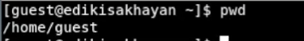{ #fig:003 width=70% }

Как видно это наша домашняя директория. Она в целом совпадает с приглашением командной строки: в командной строке есть guest (пользователь) и ~ (указывает на
то, что мы находимя в домашней директории).

Уточним имя нашего пользователя (рис. [-@fig:004]).

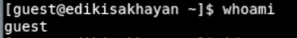{ #fig:004 width=70% }

Уточним имя нашего пользователя, его группу, а также группы, куда он входит, командой id. Выведенные значения uid, gid и др. запомнилим.
Выполним команду groups. Полученные значения совпадают с тем, что выдала id (рис. [-@fig:005]).

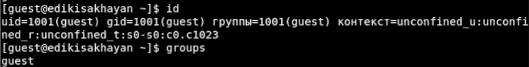{ #fig:005 width=70% }

Полученная информация об имени пользователя частично совпадает с данными, выводимыми в приглашении командной
строки, но является более подробной.

Посмторим файл /etc/passwd (рис. [-@fig:006]).

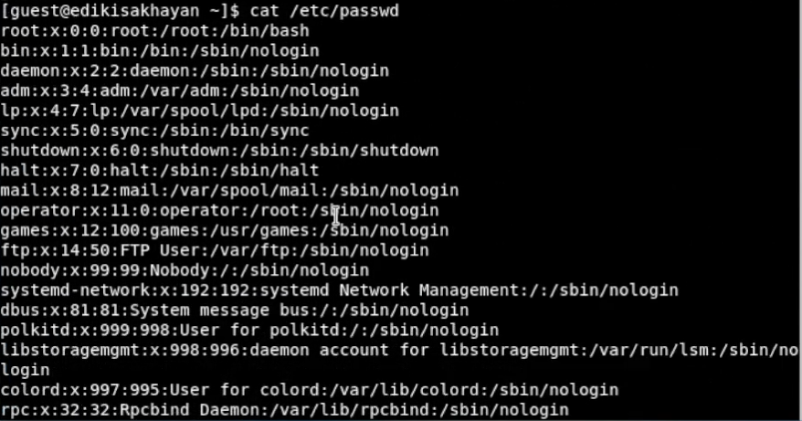{ #fig:006 width=70% }

Найдем в нем нашу учётную запись (рис. [-@fig:007]).

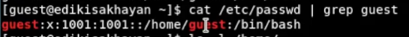{ #fig:007 width=70% }

Определим uid пользователя: 1001 и gid пользователя: 1001. Эти значения совпадают с полученными в ранее значениями.

Определим существующие в системе директории (рис. [-@fig:008]).

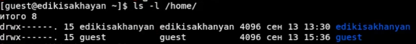{ #fig:008 width=70% }

Как видим владельцы директорий имеют на них полные права, а группы и другие пользователи не
имеют никаких прав на эти директории.

Проверим, какие расширенные атрибуты установлены на поддиректориях,
находящихся в директории (рис. [-@fig:009]).

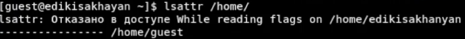{ #fig:009 width=70% }

Мы можем посмотреть только  расширенные атрибуты директории guest,
а расширенные атрибуты директорий других пользователей нам не доступны.

Создадим в домашней директории поддиректорию dir1: mkdir dir1. Определим
командами ls -l и lsattr, какие права доступа и расширенные атрибуты были
выставлены на директорию dir1 (рис. [-@fig:010] - [-@fig:011]).

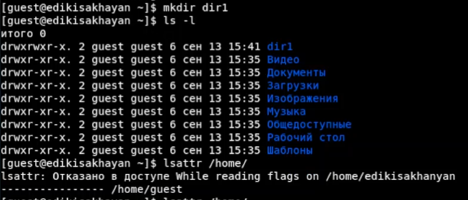{ #fig:010 width=70% }

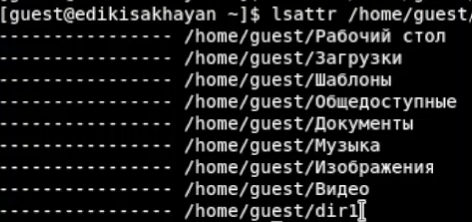{ #fig:011 width=70% }

Снимем с директории dir1 все атрибуты: chmod 000 dir1, и проверим с её
помощью правильность выполнения команды ls -l (рис. [-@fig:012]).

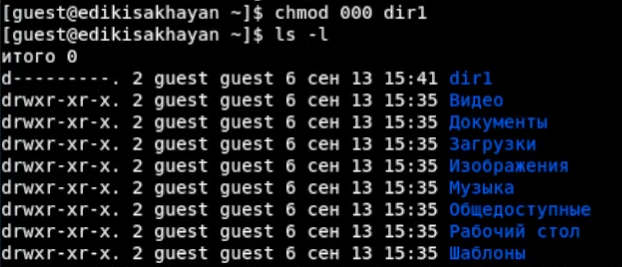{ #fig:012 width=70% }

Попытаемся создать в директории dir1 файл file1: echo “test” > /home/guest/dir1/file1 (рис. [-@fig:013]).

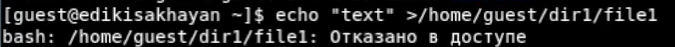{ #fig:013 width=70% }

Я получим отказ в выполнении операции по созданию файла,
т. к. мы сняли с директории все атрибуты (даже для владельцев).
Сообщение об ошибке никак не отразилось на создании файла, потому
что он не был создан.

Заполним таблицу «Установленные права и разрешённые действия», выполняя действия от имени владельца директории (файлов),
определив опытным путём, какие операции разрешены, а какие нет. Если
операция разрешена, занесем в таблицу знак «+», если не разрешена – знак
«-» (рис. [-@fig:014] - [-@fig:015]).

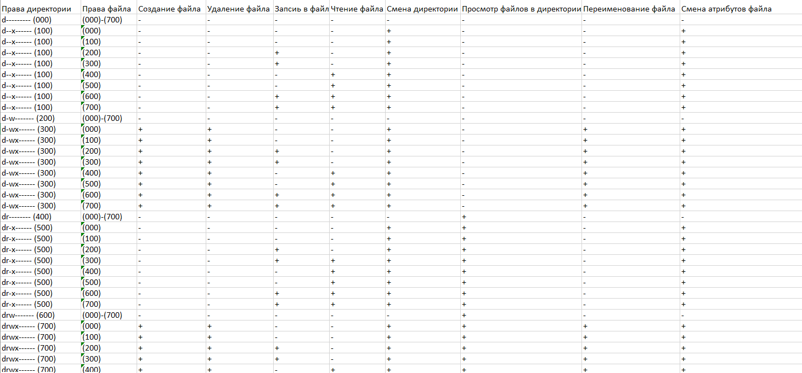{ #fig:014 width=70% }

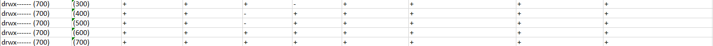{ #fig:015 width=70% }

На основании заполненной таблицы определим те или иные минимально
необходимые права для выполнения операций внутри директории dir1,
заполним таблицу «Минимальные права для совершения операций» (рис. [-@fig:016]).

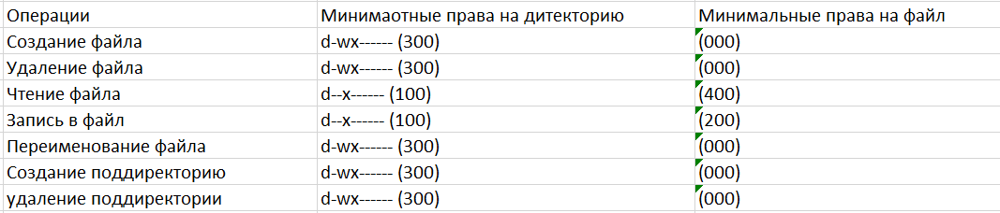{ #fig:016 width=70% }

# Выводы  
Входе работы, мы получии практические навыки работы в консоли с атрибутами файлов, закрепили
теоретические основы дискреционного разграничения доступа в современных
системах с открытым кодом на базе ОС Linux.

# Список литературы{.unnumbered}
1. Методические материалы к лабораторной работе, представленные на сайте "ТУИС РУДН" https://esystem.rudn.ru/  
::: {#refs}
:::

[^1]: Открытый источник информации