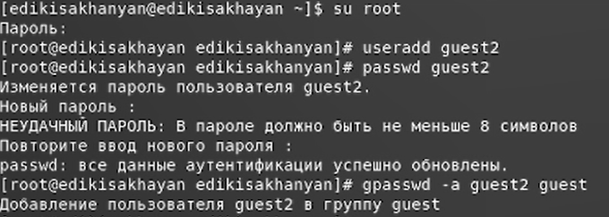
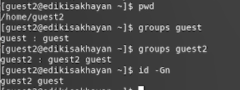
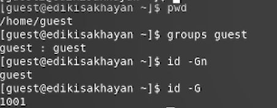
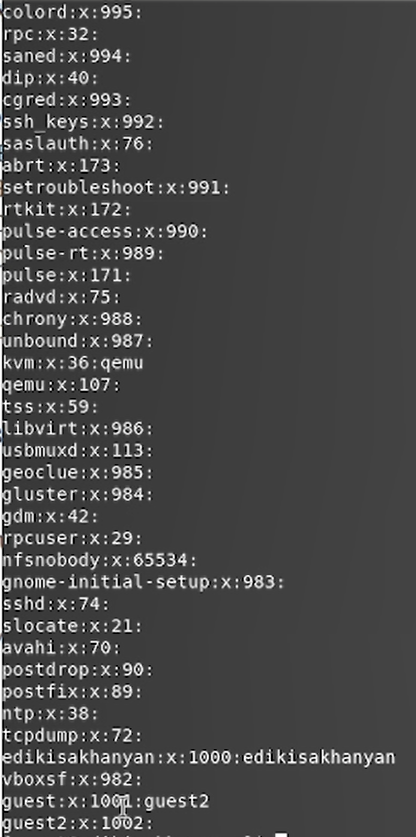
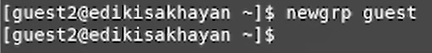
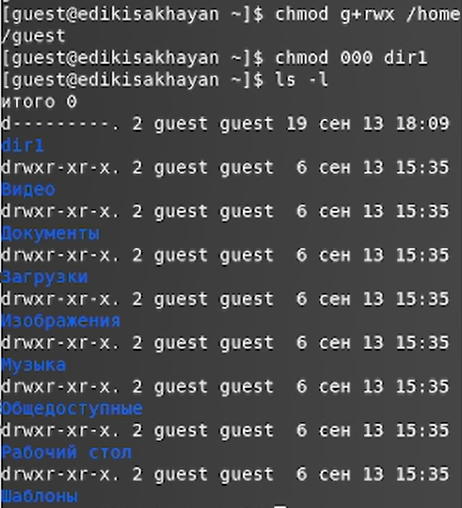
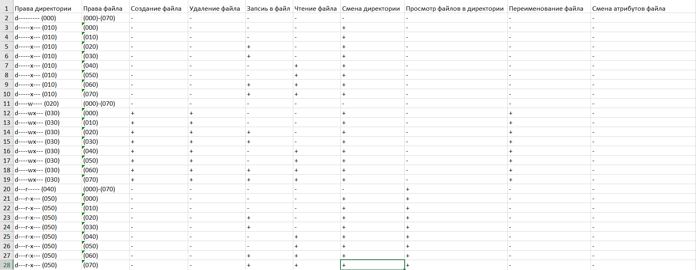
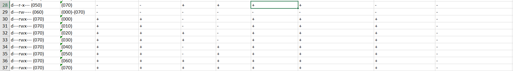
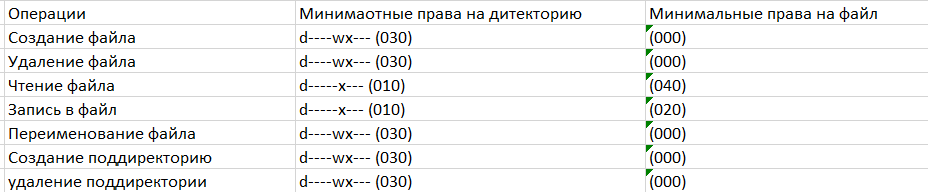

---
# Front matter
lang: ru-RU
title: Защита лабораторной работы №3 Дискреционное разграничение прав в Linux. Два пользователя
author: "Исаханян Эдуард Тигранович"
group: NFIbd-01-19
institute: RUDN University, Moscow, Russian Federation
date: 2022 Sep 17th

# Formatting
toc: false
slide_level: 2
theme: metropolis
header-includes: 
 - \metroset{progressbar=frametitle,sectionpage=progressbar,numbering=fraction}
 - '\makeatletter'
 - '\beamer@ignorenonframefalse'
 - '\makeatother'
aspectratio: 43
section-titles: true

---

# Защита лабораторной работы №3  

# Цель

Получение практических навыков работы в консоли с атрибутами файлов для групп пользователей.

## Создание пользвателя guest2

{ #fig:001 width=70% }

## Проверка информации 

{ #fig:002 width=70% }

## Проверка информации

{ #fig:003 width=70% }

## Файл /etc/group

{ #fig:004 width=70% }

## Регистрация guest2

{ #fig:005 width=70% }

## Изменение прав директорий

{ #fig:006 width=70% }

## Установленные права и разрешённые действия 1

{ #fig:007 width=70% }

## Установленные права и разрешённые действия 2

{ #fig:008 width=70% }

## Минимальные права для совершения операций

{ #fig:009 width=70% }

# Вывод   

Входе работы, мы получили практические навыки работы в консоли с атрибутами файлов для групп пользователей.

