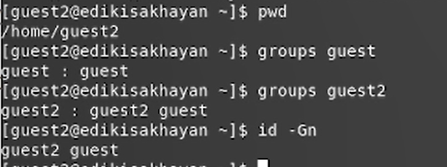

---
# Front matter
title: "Отчет по лабораторной работе №3"
subtitle: "Дискреционное разграничение прав в Linux. Два пользователя"
author: "Исаханян Эдуард Тигранович"
group: NFIbd-01-19
institute: RUDN University, Moscow, Russian Federation
date: 2022 Sep 17th

# Generic otions
lang: ru-RU
toc-title: "Содержание"

# Bibliography
bibliography: bib/cite.bib
csl: pandoc/csl/gost-r-7-0-5-2008-numeric.csl

# Pdf output format
toc: true # Table of contents
toc_depth: 2
lof: true # List of figures
lot: true # List of tables
fontsize: 12pt
linestretch: 1.5
papersize: a4
documentclass: scrreprt
### Fonts
mainfont: PT Serif
romanfont: PT Serif
sansfont: PT Sans
monofont: PT Mono
mainfontoptions: Ligatures=TeX
romanfontoptions: Ligatures=TeX
sansfontoptions: Ligatures=TeX,Scale=MatchLowercase
monofontoptions: Scale=MatchLowercase,Scale=0.9
## Biblatex
biblatex: true
biblio-style: "gost-numeric"
biblatexoptions:
- parentracker=true
- backend=biber
- hyperref=auto
- language=auto
- autolang=other*
- citestyle=gost-numeric
## Misc options
indent: true
header-includes:
- \linepenalty=10 # the penalty added to the badness of each line within a paragraph (no associated penalty node) Increasing the value makes tex try to have fewer lines in the paragraph.
- \interlinepenalty=0 # value of the penalty (node) added after each line of a paragraph.
- \hyphenpenalty=50 # the penalty for line breaking at an automatically inserted hyphen
- \exhyphenpenalty=50 # the penalty for line breaking at an explicit hyphen
- \binoppenalty=700 # the penalty for breaking a line at a binary operator
- \relpenalty=500 # the penalty for breaking a line at a relation
- \clubpenalty=150 # extra penalty for breaking after first line of a paragraph
- \widowpenalty=150 # extra penalty for breaking before last line of a paragraph
- \displaywidowpenalty=50 # extra penalty for breaking before last line before a display math
- \brokenpenalty=100 # extra penalty for page breaking after a hyphenated line
- \predisplaypenalty=10000 # penalty for breaking before a display
- \postdisplaypenalty=0 # penalty for breaking after a display
- \floatingpenalty = 20000 # penalty for splitting an insertion (can only be split footnote in standard LaTeX)
- \raggedbottom # or \flushbottom
- \usepackage{float} # keep figures where there are in the text
- \floatplacement{figure}{H} # keep figures where there are in the text
---

# Цель работы

Получение практических навыков работы в консоли с атрибутами файлов для групп пользователей.

# Выполнение лабораторной работы

В установленной операционной системе уже была создана учётная запись пользователя guest. 
Поэтому сразу создим второго пользователя guest2 (используя учётную запись администратора): 
useradd guest2 и добавим guest2 в группу guest. (рис. [-@fig:001])

{ #fig:001 width=70% }

Осуществим вход в систему от двух пользователей на двух
разных консолях: guest на первой консоли и guest2 на
второй консоли. Посел чего определим директорию для обоих пользователей,
и уточним разную информацию пользователей. (рис. [-@fig:002] и [-@fig:003]).

{ #fig:002 width=70% }

{ #fig:003 width=70% }

Посмотрим файл /etc/group. (рис. [-@fig:004])

{ #fig:004 width=70% }

Как можем заметить содержимое файла совподает с 
полученной ранее информацией.

От имени пользователя guest2 выполнил регистрацию
пользователя guest2 в группе guest. (рис. [-@fig:005])

{ #fig:005 width=70% }

От имени пользователя guest изменим права 
директории /home/guest, разрешив все действия 
для пользователей группы и снимем с директории /home/guest/dir1 
все атрибуты командой. (рис. [-@fig:006])

{ #fig:006 width=70% }

Меняя атрибуты у директории dir1 и файла file1 
от имени пользователя guest и делая проверку от 
пользователя guest2, заполним табл. 
"Установленные права и разрешенные действия для
групп", определив опытным путём, какие операции 
разрешены, а какие нет. (рис. [-@fig:007] - [-@fig:008])

{ #fig:007 width=70% }

{ #fig:008 width=70% }

Сравним  табл. 2.1 (из лабораторной работы № 2) и табл. 3.1:
различие в том, что при наличии у группы 
полных прав на директорию и на файл группа 
не может менять атрибуты файла.

На основании заполненной таблицы определил те или иные минимально необходимые права для выполнения 
пользователем guest2 операций внутри директории dir1 и заполнил табл. "Минимальные права для совершения 
операций от имени пользователей, входящих в группу". (рис. [-@fig:009])

{ #fig:009 width=70% }

# Выводы  
Входе работы, мы получили практические навыки работы в консоли с атрибутами файлов для групп пользователей.

# Список литературы{.unnumbered}
1. Методические материалы к лабораторной работе, представленные на сайте "ТУИС РУДН" https://esystem.rudn.ru/  
::: {#refs}
:::
