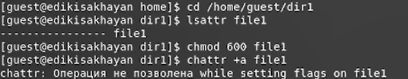
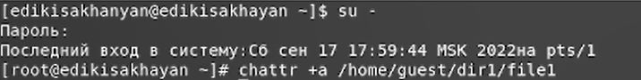
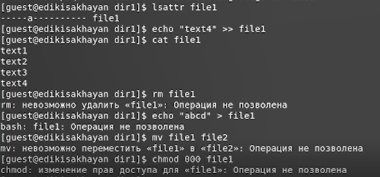
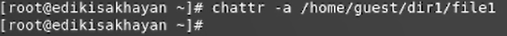
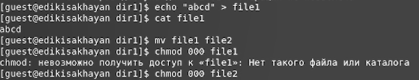
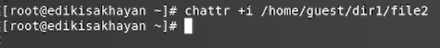
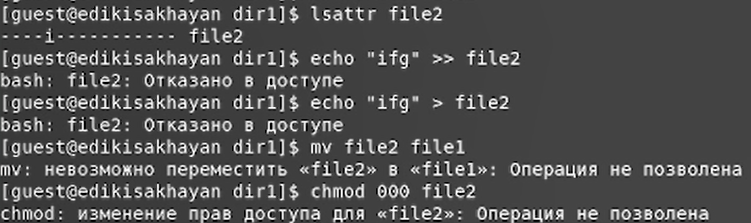

---
# Front matter
title: "Отчет по лабораторной работе №4"
subtitle: "Дискреционное разграничение прав в Linux. Расширенные атрибуты"
author: "Исаханян Эдуард Тигранович"
group: NFIbd-01-19
institute: RUDN University, Moscow, Russian Federation
date: 2022 Sep 17th

# Generic otions
lang: ru-RU
toc-title: "Содержание"

# Bibliography
bibliography: bib/cite.bib
csl: pandoc/csl/gost-r-7-0-5-2008-numeric.csl

# Pdf output format
toc: true # Table of contents
toc_depth: 2
lof: true # List of figures
lot: true # List of tables
fontsize: 12pt
linestretch: 1.5
papersize: a4
documentclass: scrreprt
### Fonts
mainfont: PT Serif
romanfont: PT Serif
sansfont: PT Sans
monofont: PT Mono
mainfontoptions: Ligatures=TeX
romanfontoptions: Ligatures=TeX
sansfontoptions: Ligatures=TeX,Scale=MatchLowercase
monofontoptions: Scale=MatchLowercase,Scale=0.9
## Biblatex
biblatex: true
biblio-style: "gost-numeric"
biblatexoptions:
- parentracker=true
- backend=biber
- hyperref=auto
- language=auto
- autolang=other*
- citestyle=gost-numeric
## Misc options
indent: true
header-includes:
- \linepenalty=10 # the penalty added to the badness of each line within a paragraph (no associated penalty node) Increasing the value makes tex try to have fewer lines in the paragraph.
- \interlinepenalty=0 # value of the penalty (node) added after each line of a paragraph.
- \hyphenpenalty=50 # the penalty for line breaking at an automatically inserted hyphen
- \exhyphenpenalty=50 # the penalty for line breaking at an explicit hyphen
- \binoppenalty=700 # the penalty for breaking a line at a binary operator
- \relpenalty=500 # the penalty for breaking a line at a relation
- \clubpenalty=150 # extra penalty for breaking after first line of a paragraph
- \widowpenalty=150 # extra penalty for breaking before last line of a paragraph
- \displaywidowpenalty=50 # extra penalty for breaking before last line before a display math
- \brokenpenalty=100 # extra penalty for page breaking after a hyphenated line
- \predisplaypenalty=10000 # penalty for breaking before a display
- \postdisplaypenalty=0 # penalty for breaking after a display
- \floatingpenalty = 20000 # penalty for splitting an insertion (can only be split footnote in standard LaTeX)
- \raggedbottom # or \flushbottom
- \usepackage{float} # keep figures where there are in the text
- \floatplacement{figure}{H} # keep figures where there are in the text
---

# Цель работы

Получение практических навыков работы в консоли с расширенными атрибутами файлов.

# Выполнение лабораторной работы

От имени пользователя guest определим расширенные атрибуты 
файла /home/guest/dir1/file1, установим на файл права, 
разрешающие чтения и запись для владельца файла и 
попробуем установить расширенный атрибут а. (рис. [-@fig:001])

{ #fig:001 width=70% }

Зайдем на вторую консоль и повысим свои права с помощью команды su. 
Попробуем установить расширенный атрибут a на файл /home/guest/dir1/file1 от имени суперпользователя. (рис. [-@fig:002])

{ #fig:002 width=70% }

От пользователя guest проверим правильность установления атрибута.
Выполним дозапись в файл file1 слова «test». После этого выполним чтение файла file1. 
Убедимся, что слово test было успешно записано в file1. Попробуем стереть имеющуюся в file1 информацию. 
Попробуем переименовать файл. Попробуем установить на файл file1 права, запрещающие чтение и запись для владельца файла. (рис. [-@fig:003])

{ #fig:003 width=70% }

Снимем расширенный атрибут a с файла /home/guest/dirl/file1 от имени суперпользователя. (рис. [-@fig:004])

{ #fig:004 width=70% }

Повторим операции, которые нам ранее не удавалось выполнить. (рис. [-@fig:005])

{ #fig:005 width=70% }

Повторим предыдущие действия по шагам, заменив атрибут a атрибутом i. (рис. [-@fig:006] - [-@fig:007])

{ #fig:006 width=70% }

{ #fig:007 width=70% }

Теперь нам не удалось даже дозаписать информацию в файл. Все остальные операции так же, как и ранее,
не удались.

# Выводы  

Входе работы, мы получили практические навыки работы в консоли с расширенными атрибутами файлов. 
Опробовали действия на практике расширенных атрибутов «а» и «i».

# Список литературы{.unnumbered}
1. Методические материалы к лабораторной работе, представленные на сайте "ТУИС РУДН" https://esystem.rudn.ru/  
::: {#refs}
:::
