---
# Front matter
lang: ru-RU
title: Защита лабораторной работы №5 Дискреционное разграничение прав в Linux. Исследование влияния дополнительных атрибутов
author: "Исаханян Эдуард Тигранович"
group: NFIbd-01-19
institute: RUDN University, Moscow, Russian Federation
date: 2022 Sep 17th

# Formatting
toc: false
slide_level: 2
theme: metropolis
header-includes: 
 - \metroset{progressbar=frametitle,sectionpage=progressbar,numbering=fraction}
 - '\makeatletter'
 - '\beamer@ignorenonframefalse'
 - '\makeatother'
aspectratio: 43
section-titles: true

---

# Защита лабораторной работы №5  

# Цель

Изучение механизмов изменения идентификаторов, применения SetUID- и Sticky-битов.
Получение практических навыков работы в консоли с дополнительными атрибутами.
Рассмотрение работы механизма смены идентификатора процессов пользователей, а также влияние бита Sticky на запись и удаление файлов.

# Выполнение лабораторной работы

## Программа simpleid.c

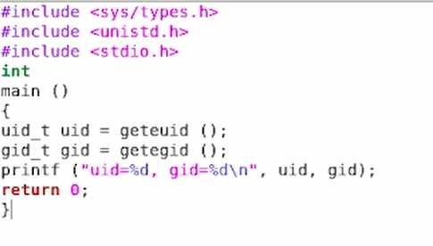{ #fig:001 width=70% }

## Компиляция и выполнение программы simpleid

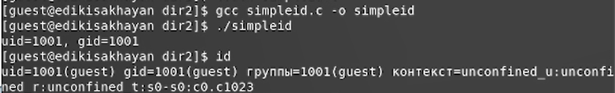{ #fig:002 width=70% }

## Программа simpleid2.c

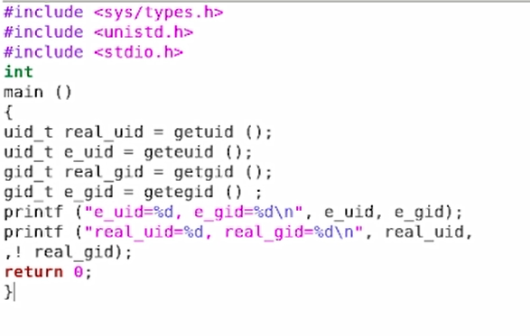{ #fig:003 width=70% }

## Компиляция и выполнение программы simpleid2

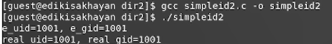{ #fig:004 width=70% }

## Смена пользователя. Установка SetUID-бита. Выполнение программы simpleid2

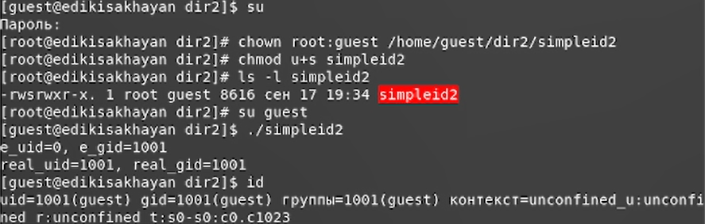{ #fig:005 width=70% }

## Установка SetGID-бита. Выполнение программы simpleid2

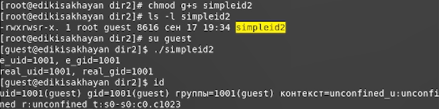{ #fig:006 width=70% }

## Программа readfile.c

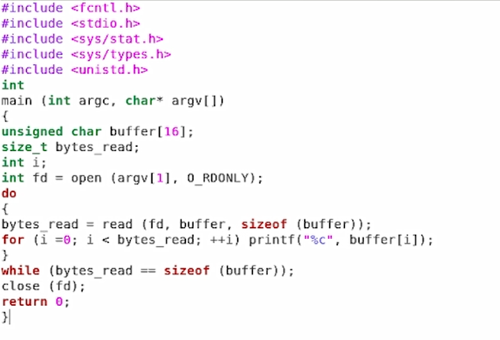{ #fig:007 width=70% }

## Работа с программой readfile.c

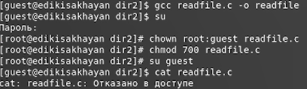{ #fig:008 width=70% }

## Установка SetUID-бита на программу readfile

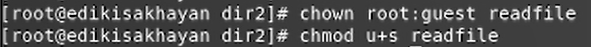{ #fig:009 width=70% }

## Программа readfile читает readfile.c

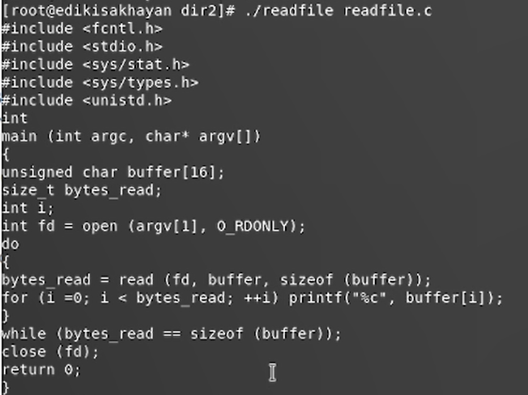{ #fig:010 width=70% }

## Программа readfile читает /etc/shadow

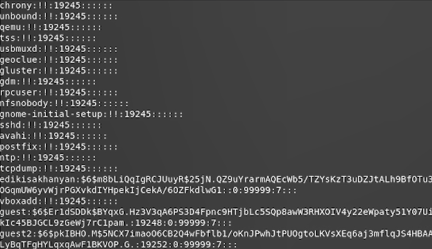{ #fig:011 width=70% }

# Исследование Sticky-бита

## Исследование Sticky-бита от имени guest

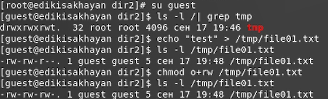{ #fig:012 width=70% }

## Работа с file01.txt от имени guest2 при наличии Sticky-бита

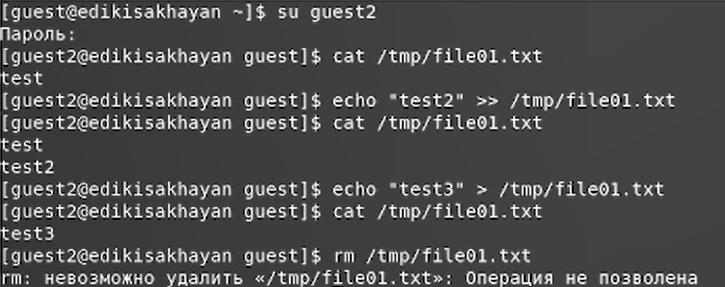{ #fig:013 width=70% }

## Снятие Sticky-бита с /tmp

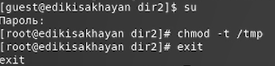{ #fig:014 width=70% }

## Работа с file01.txt от имени guest2 без Sticky-бита

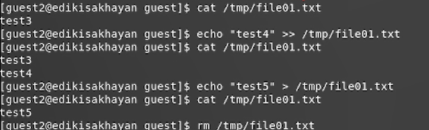{ #fig:015 width=70% }

## Возвращение Sticky-бита на /tmp

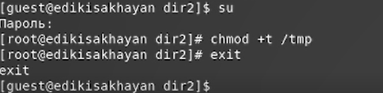{ #fig:016 width=70% }

# Вывод   

Входе работы, мы изучили механизмы изменения идентификаторов, применения SetUID- и Sticky-битов.
Получили практические навыки работы в консоли с дополнительными
атрибутами. Рассмотрели работу механизма смены идентификатора процессов
пользователей, а также влияние бита Sticky на запись и удаление файлов.

