---
# Front matter
title: "Отчет по лабораторной работе №5"
subtitle: "Дискреционное разграничение прав в Linux. Исследование влияния дополнительных атрибутов"
author: "Исаханян Эдуард Тигранович"
group: NFIbd-01-19
institute: RUDN University, Moscow, Russian Federation
date: 2022 Sep 17th

# Generic otions
lang: ru-RU
toc-title: "Содержание"

# Bibliography
bibliography: bib/cite.bib
csl: pandoc/csl/gost-r-7-0-5-2008-numeric.csl

# Pdf output format
toc: true # Table of contents
toc_depth: 2
lof: true # List of figures
lot: true # List of tables
fontsize: 12pt
linestretch: 1.5
papersize: a4
documentclass: scrreprt
### Fonts
mainfont: PT Serif
romanfont: PT Serif
sansfont: PT Sans
monofont: PT Mono
mainfontoptions: Ligatures=TeX
romanfontoptions: Ligatures=TeX
sansfontoptions: Ligatures=TeX,Scale=MatchLowercase
monofontoptions: Scale=MatchLowercase,Scale=0.9
## Biblatex
biblatex: true
biblio-style: "gost-numeric"
biblatexoptions:
- parentracker=true
- backend=biber
- hyperref=auto
- language=auto
- autolang=other*
- citestyle=gost-numeric
## Misc options
indent: true
header-includes:
- \linepenalty=10 # the penalty added to the badness of each line within a paragraph (no associated penalty node) Increasing the value makes tex try to have fewer lines in the paragraph.
- \interlinepenalty=0 # value of the penalty (node) added after each line of a paragraph.
- \hyphenpenalty=50 # the penalty for line breaking at an automatically inserted hyphen
- \exhyphenpenalty=50 # the penalty for line breaking at an explicit hyphen
- \binoppenalty=700 # the penalty for breaking a line at a binary operator
- \relpenalty=500 # the penalty for breaking a line at a relation
- \clubpenalty=150 # extra penalty for breaking after first line of a paragraph
- \widowpenalty=150 # extra penalty for breaking before last line of a paragraph
- \displaywidowpenalty=50 # extra penalty for breaking before last line before a display math
- \brokenpenalty=100 # extra penalty for page breaking after a hyphenated line
- \predisplaypenalty=10000 # penalty for breaking before a display
- \postdisplaypenalty=0 # penalty for breaking after a display
- \floatingpenalty = 20000 # penalty for splitting an insertion (can only be split footnote in standard LaTeX)
- \raggedbottom # or \flushbottom
- \usepackage{float} # keep figures where there are in the text
- \floatplacement{figure}{H} # keep figures where there are in the text
---

# Цель работы

Изучение механизмов изменения идентификаторов, применения SetUID- и Sticky-битов. 
Получение практических навыков работы в консоли с дополнительными атрибутами. 
Рассмотрение работы механизма смены идентификатора процессов пользователей, а также влияние бита Sticky на запись и удаление файлов.

# Выполнение лабораторной работы

## Создание программы

Войдем в систему от имени пользователя guest.
создадим программу simpleid.c по шаблону из методички. (рис. [-@fig:001])

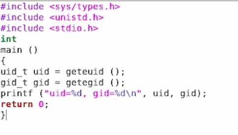{ #fig:001 width=70% }

Скомпилируем программу и убедимся, что файл программы
создан, после чего выполним программу и сравним с
id. (рис. [-@fig:002])

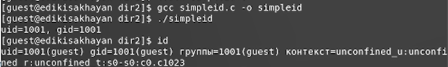{ #fig:002 width=70% }

Полученный результат совпадает с id.

Усложним программу, добавив вывод действительных идентификаторов согласно шаблону из методички. (рис. [-@fig:003])

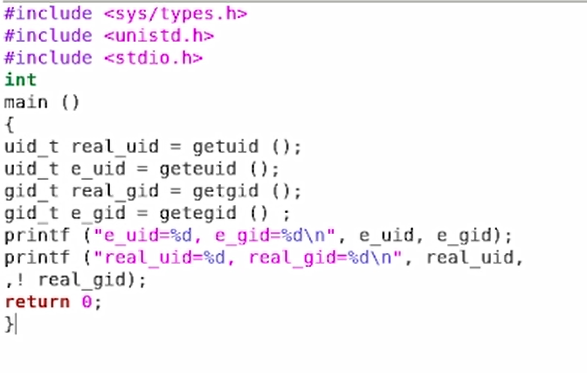{ #fig:003 width=70% }

Скомпилируем и запустим программу simpleid2.c. (рис. [-@fig:004])

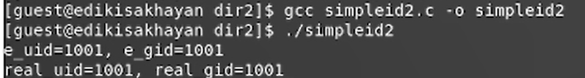{ #fig:004 width=70% }

От имени суперпользователя выполним команды: chown root:guest /home/guest/simpl и chmod u+s /home/guest/simpl.
Выполним проверку правильности установки новых атрибутов и смены владельца файла simpl и запустим программу. (рис. [-@fig:005])

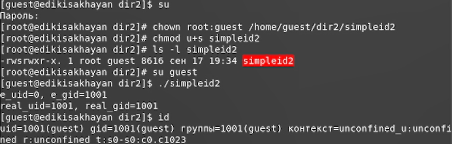{ #fig:005 width=70% }

Проделаем то же самое относительно SetGID-бита. (рис. [-@fig:006])

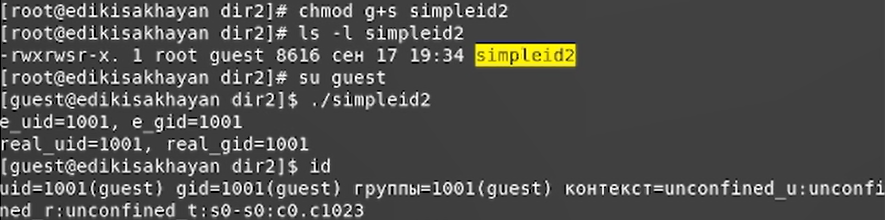{ #fig:006 width=70% }

Создадим программу readfile.c по шаблону из методички. (рис. [-@fig:007])

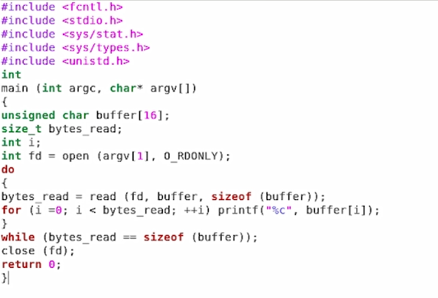{ #fig:007 width=70% }

Откомпилируем программу и сменим владельца и изменим права так, чтобы только суперпользователь (root) мог прочитать его, a guest не мог,
и проверим это. (рис. [-@fig:008])

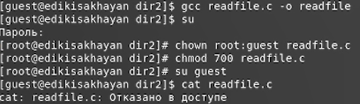{ #fig:008 width=70% }

Установим SetUID-бит. (рис. [-@fig:009])

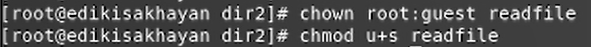{ #fig:009 width=70% }

Проверим, может ли программа readfile прочитать файл readfile.c. (рис. [-@fig:010])

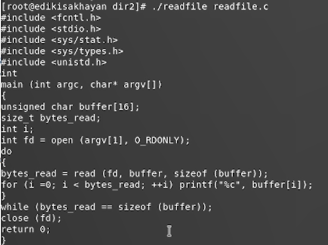{ #fig:010 width=70% }

Проверим, может ли программа readfile прочитать файл /etc/shadow. (рис. [-@fig:011])

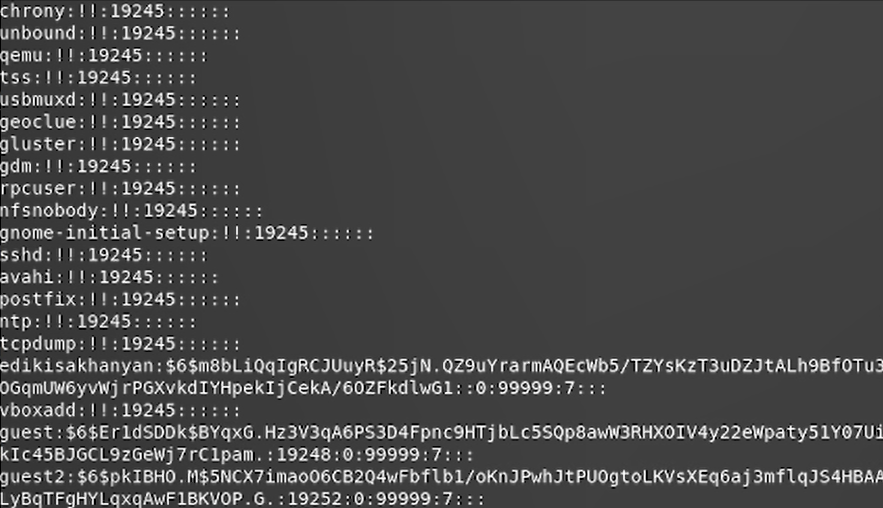{ #fig:011 width=70% }

## Исследование Sticky-бита

Выясним, установлен ли атрибут Sticky на директории
/tmp, после чего от имени пользователя guest создал файл
file01.txt в директории со словом test. Просмотрим атрибуты у только что созданного файла и разрешим чтение и запись для категории пользователей «все остальные». (рис. [-@fig:012])

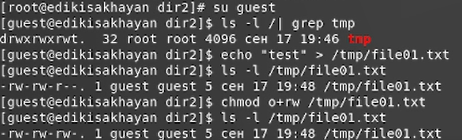{ #fig:012 width=70% }

От имени пользователя попробовал разные операции над файлом
file01.txt. (рис. [-@fig:013])

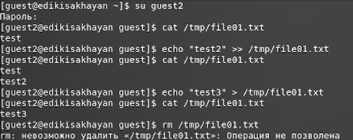{ #fig:013 width=70% }

Повысим свои права до суперпользователя, и
выполним после этого команду, снимающую атрибут t (Sticky-бит) с директории 
и покиним режим суперпользователя. (рис. [-@fig:014])

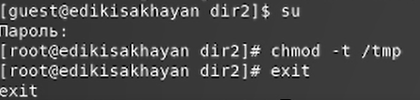{ #fig:014 width=70% }

Проверим те же операции после стнятия атрибута t. (рис. [-@fig:015])

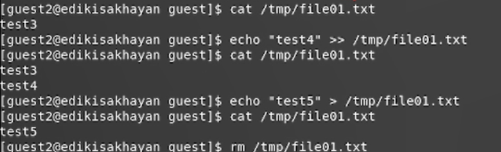{ #fig:015 width=70% }

Нам удалось удалить файл от имени пользователя, не являющегося
его владельцем.

Повысим свои права до суперпользователя, и
выполним после этого команду, добавляющее атрибут t (Sticky-бит) к директории
и покиним режим суперпользователя. (рис. [-@fig:016])

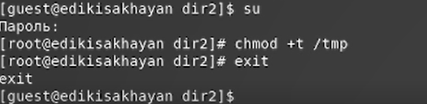{ #fig:016 width=70% }

# Выводы  
Входе работы, мы изучили механизмы изменения идентификаторов, применения SetUID- и Sticky-битов. 
Получили практические навыки работы в консоли с дополнительными
атрибутами. Рассмотрели работу механизма смены идентификатора процессов
пользователей, а также влияние бита Sticky на запись и удаление файлов.

# Список литературы{.unnumbered}
1. Методические материалы к лабораторной работе, представленные на сайте "ТУИС РУДН" https://esystem.rudn.ru/  
::: {#refs}
:::
