---
# Front matter
lang: ru-RU
title: Защита лабораторной работы №6 Мандатное разграничение прав в Linux
author: "Исаханян Эдуард Тигранович"
group: NFIbd-01-19
institute: RUDN University, Moscow, Russian Federation
date: 2022 Sep 21th

# Formatting
toc: false
slide_level: 2
theme: metropolis
header-includes: 
 - \metroset{progressbar=frametitle,sectionpage=progressbar,numbering=fraction}
 - '\makeatletter'
 - '\beamer@ignorenonframefalse'
 - '\makeatother'
aspectratio: 43
section-titles: true

---

# Защита лабораторной работы №6  

# Цель

Развить навыки администрирования ОС Linux. Получить первое практическое знакомство с технологией SELinux1. Проверить работу SELinx на практике совместно с веб-сервером Apache.

# Подготовка лабораторного стенда

## Параметр ServerName

{ #fig:001 width=70% }

## Отключение фильтра

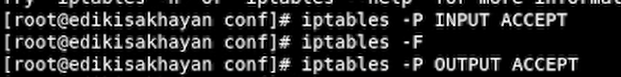{ #fig:002 width=70% height=70% }

## Отключение фильтра

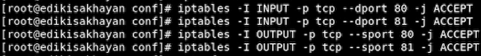{ #fig:003 width=70% height=70% }

# Выполнение лабораторной работы

## Проверка режима и политики

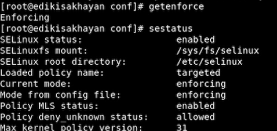{ #fig:004 width=70% height=70% }

## Проверка через браузер

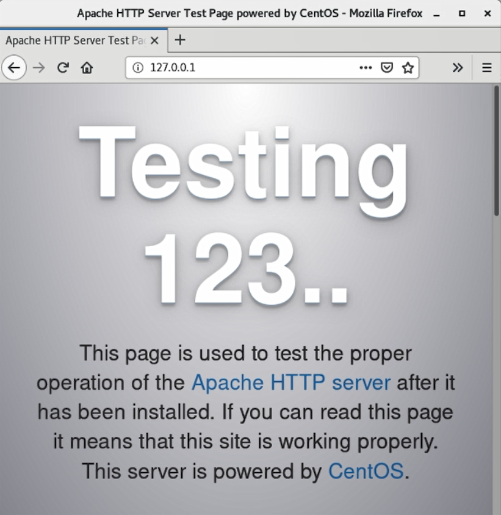{ #fig:005 width=70% height=70% }

## Проверка через браузер

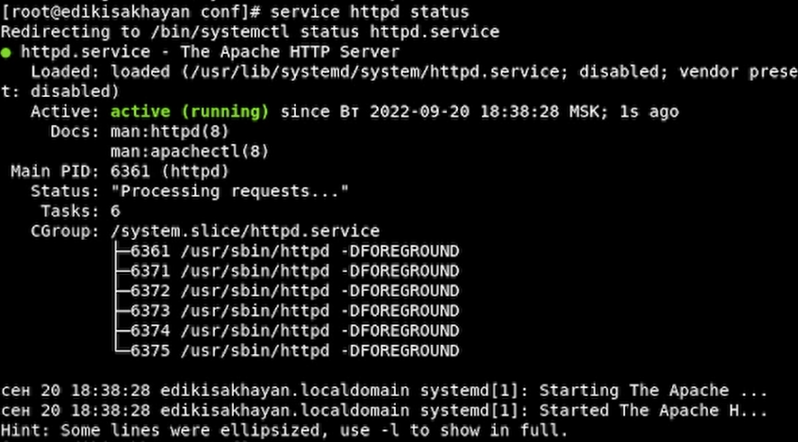{ #fig:006 width=70% height=70% }

## веб-сервер Apache

{ #fig:007 width=70% height=70% }

## Просмотр переключателей SELinux для Apache

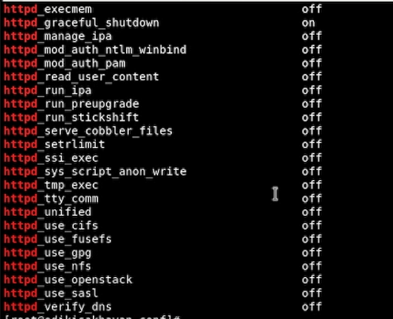{ #fig:008 width=70% height=70% }

## Статистика

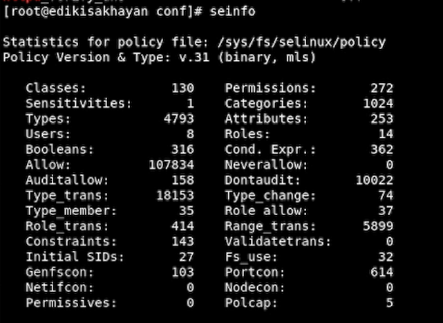{ #fig:009 width=70% height=70% }

## Определение типов файлов и круг пользователей

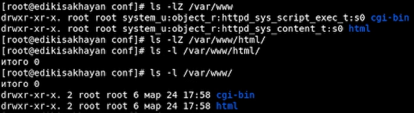{ #fig:010 width=70% height=70% }

## Создание файла

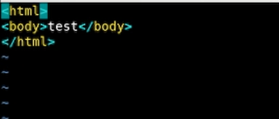{ #fig:011 width=70% height=70% }

## Проверка

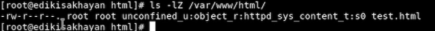{ #fig:012 width=70% height=70% }

## Получение доступа к файлу через браузер

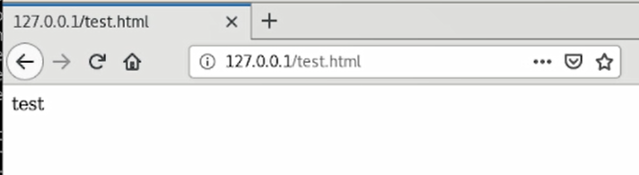{ #fig:013 width=50% height=50% }

## Изменение контекста, проверка

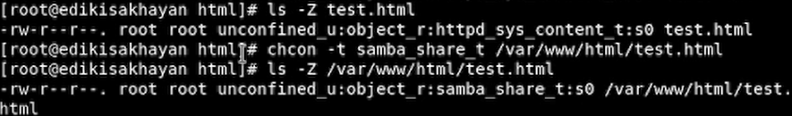{ #fig:014 width=50% height=50% }

## Получение доступа к файлу через браузер

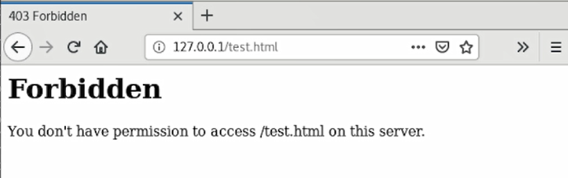{ #fig:015 width=50% height=50% }

## Анализ ситуации

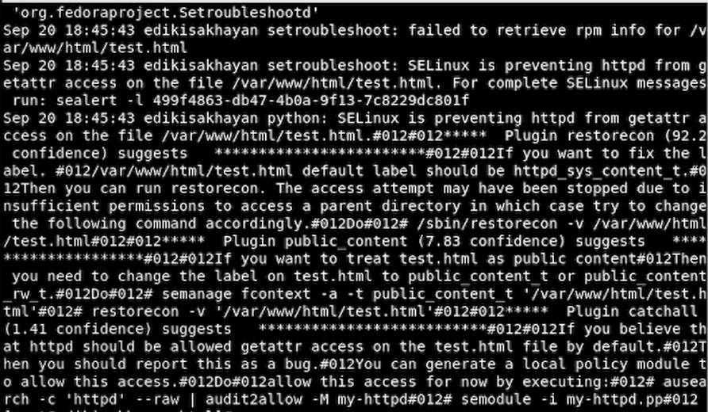{ #fig:016 width=50% height=50% }

## Изменеие порта 80 на 81

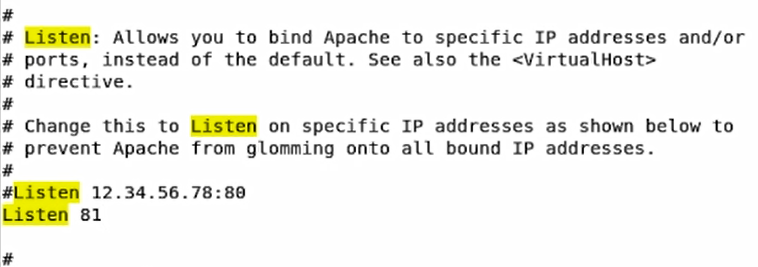{ #fig:017 width=50% height=50% }

## Анализ и просмотр лог-файлов

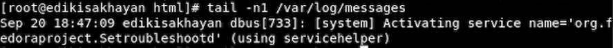{ #fig:018 width=50% height=50% }

## Выполнение и проверка

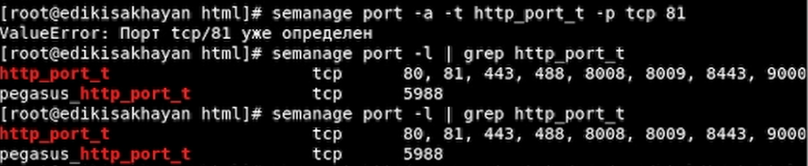{ #fig:019 width=50% height=50% }

## Возвращение контекста

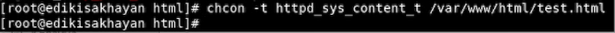{ #fig:020 width=50% height=50% }

## Получение доступа к файлу через браузер

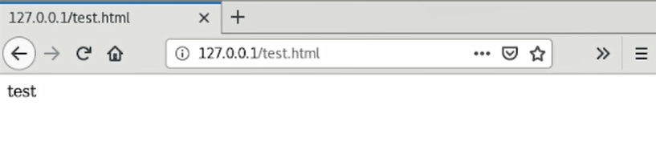{ #fig:021 width=50% height=50% }

## Исправленный файл apache

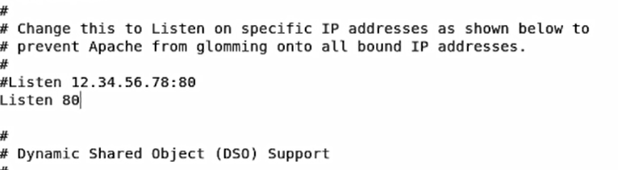{ #fig:022 width=50% height=50% }

## Удаление привязки к 81 порту и удаление файла

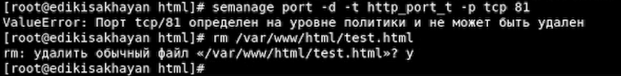{ #fig:023 width=50% height=50% }

# Вывод   

Входе работы, мы развили навыки администрирования ОС Linux. Получили первое практическое знакомство
с технологией SELinux. Проверили работу SELinx на практике совместно с
веб-сервером Apache.

