---
# Front matter
title: "Отчет по лабораторной работе №6"
subtitle: "Мандатное разграничение прав в Linux"
author: "Исаханян Эдуард Тигранович"
group: NFIbd-01-19
institute: RUDN University, Moscow, Russian Federation
date: 2022 Sep 21th

# Generic otions
lang: ru-RU
toc-title: "Содержание"

# Bibliography
bibliography: bib/cite.bib
csl: pandoc/csl/gost-r-7-0-5-2008-numeric.csl

# Pdf output format
toc: true # Table of contents
toc_depth: 2
lof: true # List of figures
lot: true # List of tables
fontsize: 12pt
linestretch: 1.5
papersize: a4
documentclass: scrreprt
### Fonts
mainfont: PT Serif
romanfont: PT Serif
sansfont: PT Sans
monofont: PT Mono
mainfontoptions: Ligatures=TeX
romanfontoptions: Ligatures=TeX
sansfontoptions: Ligatures=TeX,Scale=MatchLowercase
monofontoptions: Scale=MatchLowercase,Scale=0.9
## Biblatex
biblatex: true
biblio-style: "gost-numeric"
biblatexoptions:
- parentracker=true
- backend=biber
- hyperref=auto
- language=auto
- autolang=other*
- citestyle=gost-numeric
## Misc options
indent: true
header-includes:
- \linepenalty=10 # the penalty added to the badness of each line within a paragraph (no associated penalty node) Increasing the value makes tex try to have fewer lines in the paragraph.
- \interlinepenalty=0 # value of the penalty (node) added after each line of a paragraph.
- \hyphenpenalty=50 # the penalty for line breaking at an automatically inserted hyphen
- \exhyphenpenalty=50 # the penalty for line breaking at an explicit hyphen
- \binoppenalty=700 # the penalty for breaking a line at a binary operator
- \relpenalty=500 # the penalty for breaking a line at a relation
- \clubpenalty=150 # extra penalty for breaking after first line of a paragraph
- \widowpenalty=150 # extra penalty for breaking before last line of a paragraph
- \displaywidowpenalty=50 # extra penalty for breaking before last line before a display math
- \brokenpenalty=100 # extra penalty for page breaking after a hyphenated line
- \predisplaypenalty=10000 # penalty for breaking before a display
- \postdisplaypenalty=0 # penalty for breaking after a display
- \floatingpenalty = 20000 # penalty for splitting an insertion (can only be split footnote in standard LaTeX)
- \raggedbottom # or \flushbottom
- \usepackage{float} # keep figures where there are in the text
- \floatplacement{figure}{H} # keep figures where there are in the text
---

# Цель работы

Развить навыки администрирования ОС Linux. Получить первое практическое знакомство с технологией SELinux1. Проверить работу SELinx на практике совместно с веб-сервером Apache.

# Выполнение лабораторной работы

## Подготовка лабораторного стенда

В конфигурационном файле /etc/httpd/httpd.conf зададим параметр
ServerName. (рис. [-@fig:001])

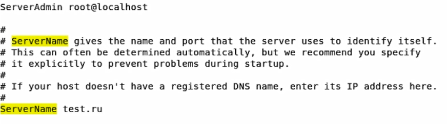{ #fig:001 width=70% }

Также проследим, чтобы пакетный фильтр был отключён или в своей рабочей конфигурации позволял подключаться к 80-у и 81-у портам протокола tcp. Отключим фильтр и добавим разрешающие правила.
(рис. [-@fig:002] - [-@fig:003])

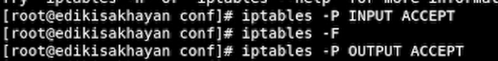{ #fig:002 width=70% height=70% }

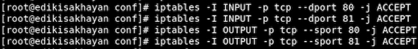{ #fig:003 width=70% height=70% }

## Выполнение лабораторной работы

Войдем в систему с полученными учётными данными и убедимся, что SELinux работает в режиме enforcing политики targeted. (рис. [-@fig:004])

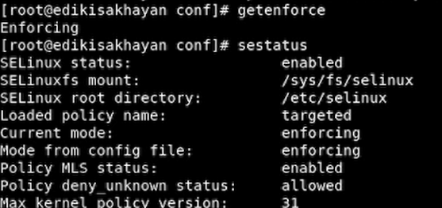{ #fig:004 width=70% height=70% }

Обратимся с помощью браузера к веб-серверу, запущенному на компьютере, и убедимся, что последний работает. (рис. [-@fig:005] - [-@fig:006])

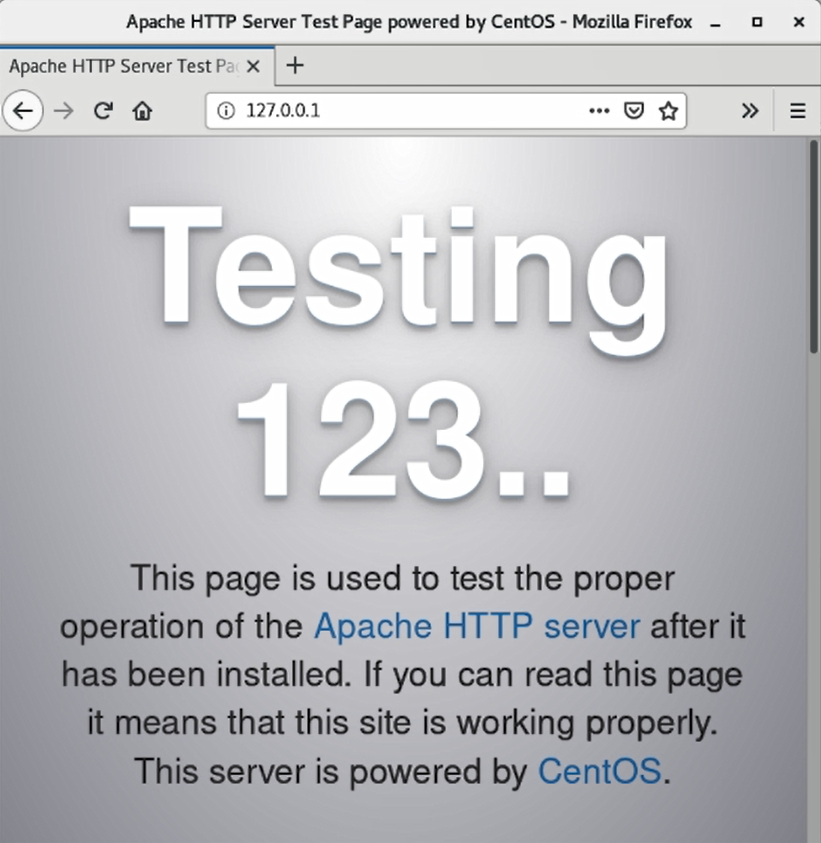{ #fig:005 width=70% height=70% }

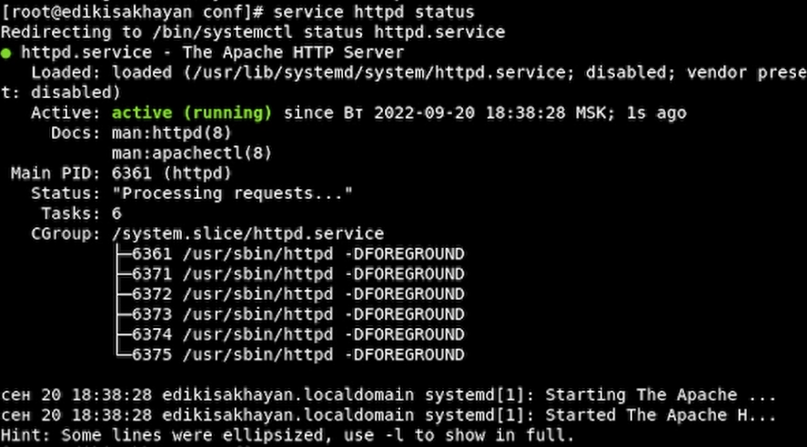{ #fig:006 width=70% height=70% }

Найдем веб-сервер Apache в списке процессов, определим его контекст безопасности. (рис. [-@fig:007])

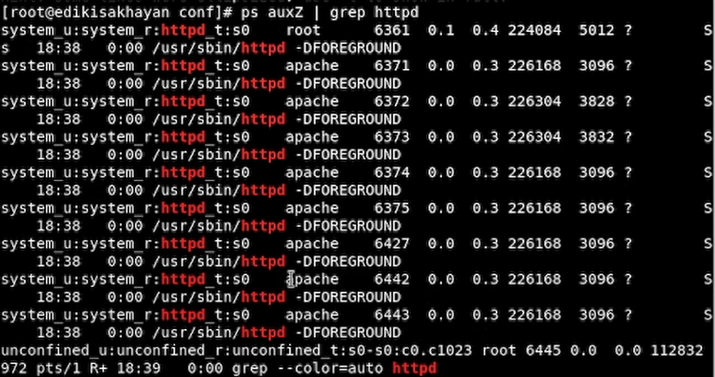{ #fig:007 width=70% height=70% }

Посмотрем текущее состояние переключателей SELinux для Apache. (рис. [-@fig:008])

{ #fig:008 width=70% height=70% }

Посмотрем статистику по политике, также определил множество пользователей(8), ролей(14), типов(4793). (рис. [-@fig:009])

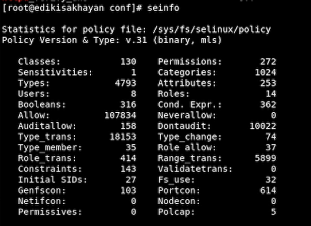{ #fig:009 width=70% height=70% }

Определим тип файлов и поддиректорий, находящихся в директории /var/www, также определим тип файлов, 
находящихся в директории /var/www/html: ls -lZ /var/www/html, и ппределим круг пользователей, которым разрешено 
создание файлов в директории /var/www/html. (рис. [-@fig:010])

{ #fig:010 width=70% height=70% }

Создадим от имени суперпользователя html-файл /var/www/html/test.html. (рис. [-@fig:011])

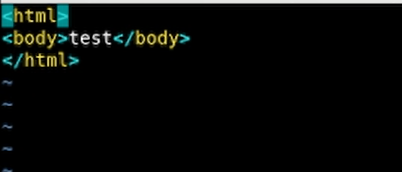{ #fig:011 width=70% height=70% }

Проверим контекст созданного файла: httpd_sys_content_t. (рис. [-@fig:012])

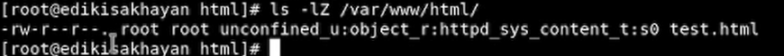{ #fig:012 width=70% height=70% }

Обратимся к файлу через веб-сервер, введя в браузере адрес http://127.0.0.1/test.html. Убедимся, что файл был успешно отображён. (рис. [-@fig:013])

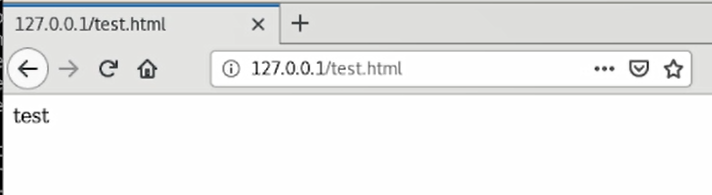{ #fig:013 width=50% height=50% }

Проверим контекст файла и изменим контекст файла /var/www/html/test.html с httpd_sys_content_t на samba_share_t. После этого проверим, что контекст поменялся. (рис. [-@fig:014])

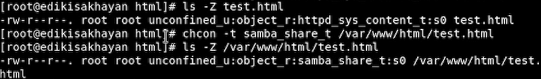{ #fig:014 width=50% height=50% }

Попробуем ещё раз получить доступ к файлу через веб-сервер, введя в браузере адрес http://127.0.0.1/test.html. Получим сообщение об ошибке. (рис. [-@fig:015])

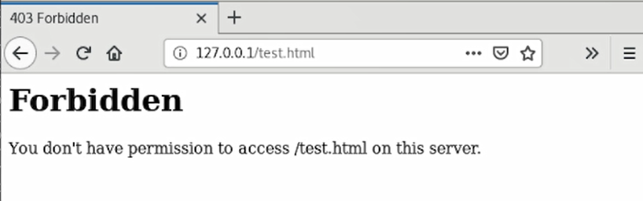{ #fig:015 width=50% height=50% }

Файл не был отображён потому что мы изменили контекст файла. Просмотрем log-файлы веб-сервера Apache. Также просмотрем системный лог-файл: tail /var/log/messages. (рис. [-@fig:016])

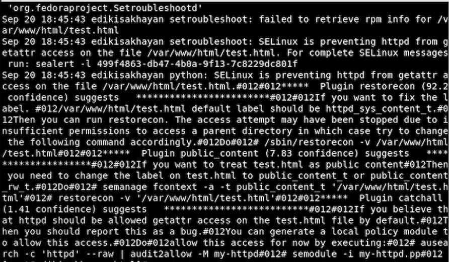{ #fig:016 width=50% height=50% }

Попробуем запустить веб-сервер Apache на прослушивание ТСР-порта 81 (а не 80, как рекомендует IANA и прописано в /etc/services). Для этого в файле /etc/httpd/httpd.conf найдем строчку Listen 80 и заменим её на Listen 81. (рис. [-@fig:017])

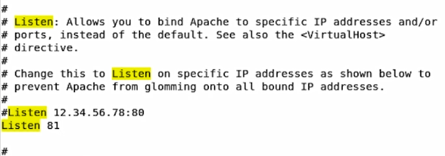{ #fig:017 width=50% height=50% }

Просмотрем файл /var/log/http/error_log. (рис. [-@fig:018])

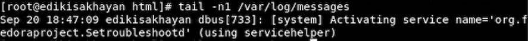{ #fig:018 width=50% height=50% }

Выполним команду: semanage port -a -t http_port_t -р tcp 81. После этого проверим список портов. 
Убедимся, что порт 81 появился в списке. (рис. [-@fig:019])

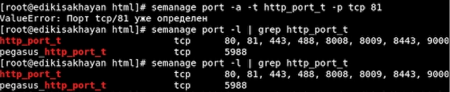{ #fig:019 width=50% height=50% }

Вернем контекст httpd_sys_cоntent__t к файлу /var/www/html/test.html. После этого попробуем получить доступ к файлу через веб-сервер, введя в браузере адрес http://127.0.0.1:81/test.html. 
Снова увидим содержимое файла — слово «test». (рис. [-@fig:020] - [-@fig:021])

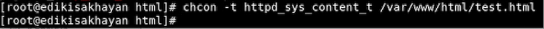{ #fig:020 width=50% height=50% }

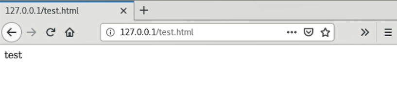{ #fig:021 width=50% height=50% }

Исправим обратно конфигурационный файл apache, вернув Listen80. (рис. [-@fig:022])

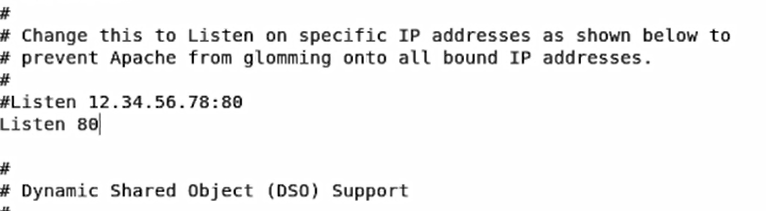{ #fig:022 width=50% height=50% }

Удалим привязку http_port_t к 81 порту и удалим файл /var/www/html/test.html. (рис. [-@fig:023])

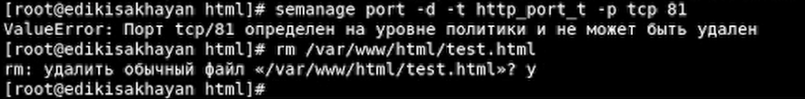{ #fig:023 width=50% height=50% }

# Выводы

Входе работы, мы развили навыки администрирования ОС Linux. Получили первое практическое знакомство 
с технологией SELinux. Проверили работу SELinx на практике совместно с
веб-сервером Apache.

# Список литературы{.unnumbered}
1. Методические материалы к лабораторной работе, представленные на сайте "ТУИС РУДН" https://esystem.rudn.ru/  
::: {#refs}
:::
