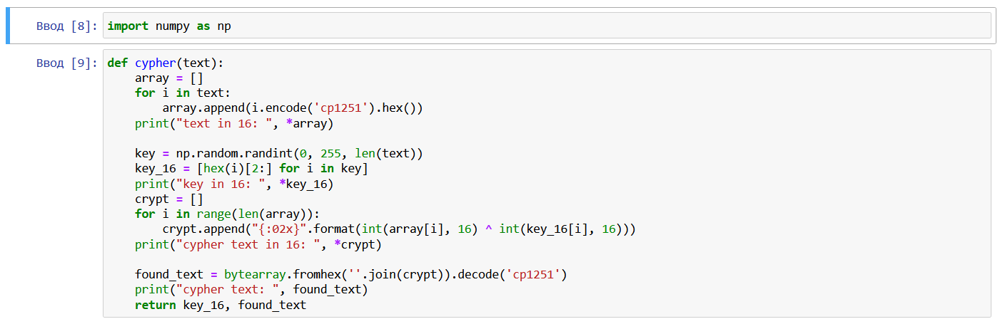
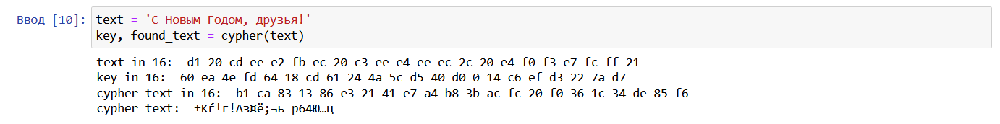
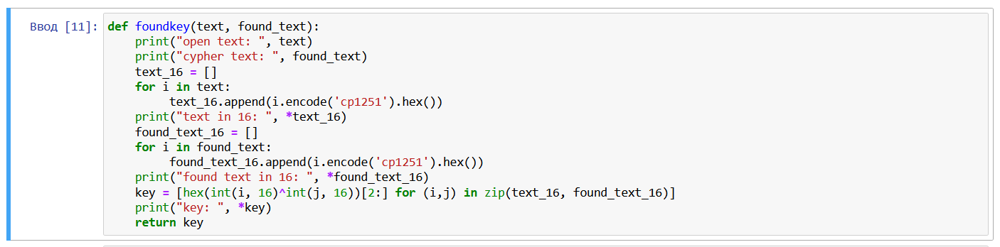
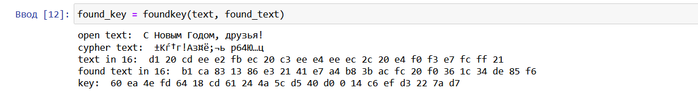
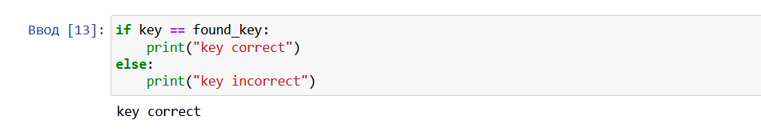

---
# Front matter
lang: ru-RU
title: Защита лабораторной работы №7 Элементы криптографии. Однократное гаммирование
author: "Исаханян Эдуард Тигранович"
group: NFIbd-01-19
institute: RUDN University, Moscow, Russian Federation
date: 2022 Sep 21th

# Formatting
toc: false
slide_level: 2
theme: metropolis
header-includes: 
 - \metroset{progressbar=frametitle,sectionpage=progressbar,numbering=fraction}
 - '\makeatletter'
 - '\beamer@ignorenonframefalse'
 - '\makeatother'
aspectratio: 43
section-titles: true

---

# Защита лабораторной работы №7  

# Цель

Освоить на практике применение режима однократного гаммирования.

# Задание

1. Написать программу, которая должна определить вид шифротекста при известном ключе и известном открытом тексте;
2. Также эта программа должна определить ключ, с помощью которого шифротекст может быть преобразован в некоторый фрагмент текста, представляющий собой один из возможных вариантов прочтения открытого текста.

## Функция, шифрующая данные

{ #fig:001 width=70% }

## Результат работы функции, шифрующей данные

{ #fig:002 width=70% }

## Функция, дешифрующая данные

{ #fig:003 width=70% }

## Результат работы функции, шифрующей данные

{ #fig:004 width=70% }

## Сравнение ключей

{ #fig:005 width=70% }

# Вывод   

Освоили на практике применение режима однократного гаммирования.

