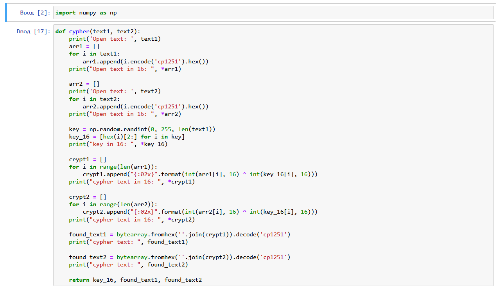
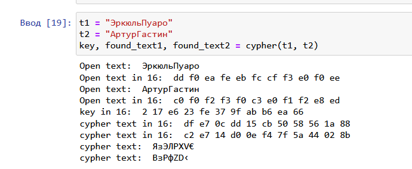
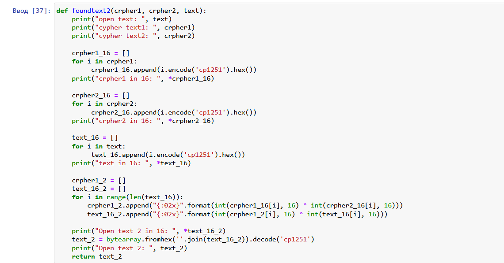
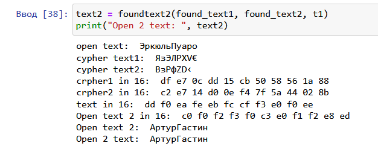
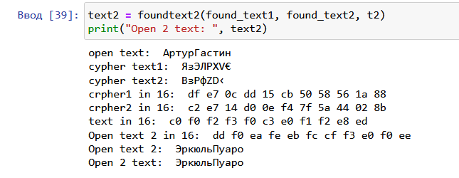

---
# Front matter
lang: ru-RU
title: Защита лабораторной работы №8 Элементы криптографии. Шифрование (кодирование) различных исходных текстов одним ключом
author: "Исаханян Эдуард Тигранович"
group: NFIbd-01-19
institute: RUDN University, Moscow, Russian Federation
date: 2022 Sep 21th

# Formatting
toc: false
slide_level: 2
theme: metropolis
header-includes: 
 - \metroset{progressbar=frametitle,sectionpage=progressbar,numbering=fraction}
 - '\makeatletter'
 - '\beamer@ignorenonframefalse'
 - '\makeatother'
aspectratio: 43
section-titles: true

---

# Защита лабораторной работы №8  

# Цель работы

Освоить на практике применение режима однократного гаммирования на примере кодирования различных исходных текстов одним ключом.

# Задание

1. Написать программу, которая должна определять вид шифротекстов при известных открытых текстах и при известном ключе;

2. Также эта программа должна определить вид одного из текстов, зная вид другого открытого текста и  зашифрованный вид обоих текстов (т.е. не нужно использовать ключ при дешифровке).

## Функция, шифрующая данные

{ #fig:001 width=70% }

## Результат работы функции, шифрующей данные

{ #fig:002 width=70% }

## Функция, дешифрующая данные

{ #fig:003 width=70% }

## Результат работы функции, дешифрующей данные

{ #fig:004 width=70% }

## Результат работы функции, дешифрующей данные

{ #fig:005 width=70% }

# Вывод   

Освоил на практике применение режима однократного гаммирования на примере кодирования различных исходных текстов одним ключом.

