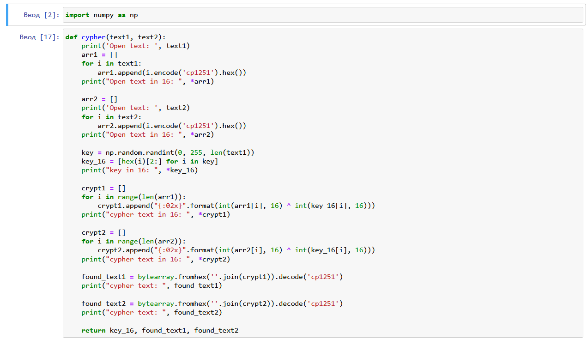
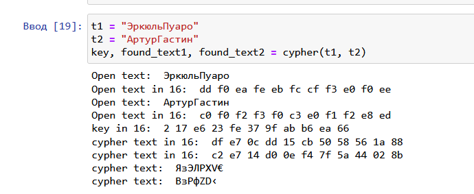
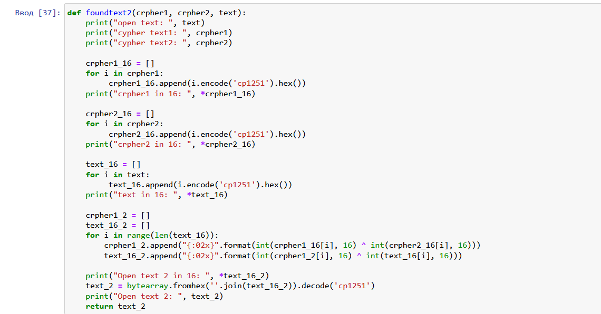
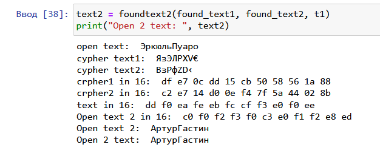
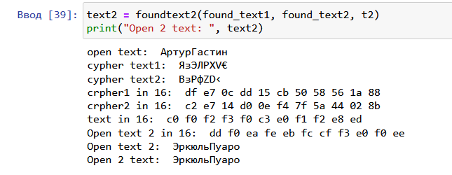

---
# Front matter
title: "Отчет по лабораторной работе №8"
subtitle: "Элементы криптографии. Шифрование (кодирование) различных исходных текстов одним ключом"
author: "Исаханян Эдуард Тигранович"
group: NFIbd-01-19
institute: RUDN University, Moscow, Russian Federation
date: 2022 Sep 21th

# Generic otions
lang: ru-RU
toc-title: "Содержание"

# Bibliography
bibliography: bib/cite.bib
csl: pandoc/csl/gost-r-7-0-5-2008-numeric.csl

# Pdf output format
toc: true # Table of contents
toc_depth: 2
lof: true # List of figures
lot: true # List of tables
fontsize: 12pt
linestretch: 1.5
papersize: a4
documentclass: scrreprt
### Fonts
mainfont: PT Serif
romanfont: PT Serif
sansfont: PT Sans
monofont: PT Mono
mainfontoptions: Ligatures=TeX
romanfontoptions: Ligatures=TeX
sansfontoptions: Ligatures=TeX,Scale=MatchLowercase
monofontoptions: Scale=MatchLowercase,Scale=0.9
## Biblatex
biblatex: true
biblio-style: "gost-numeric"
biblatexoptions:
- parentracker=true
- backend=biber
- hyperref=auto
- language=auto
- autolang=other*
- citestyle=gost-numeric
## Misc options
indent: true
header-includes:
- \linepenalty=10 # the penalty added to the badness of each line within a paragraph (no associated penalty node) Increasing the value makes tex try to have fewer lines in the paragraph.
- \interlinepenalty=0 # value of the penalty (node) added after each line of a paragraph.
- \hyphenpenalty=50 # the penalty for line breaking at an automatically inserted hyphen
- \exhyphenpenalty=50 # the penalty for line breaking at an explicit hyphen
- \binoppenalty=700 # the penalty for breaking a line at a binary operator
- \relpenalty=500 # the penalty for breaking a line at a relation
- \clubpenalty=150 # extra penalty for breaking after first line of a paragraph
- \widowpenalty=150 # extra penalty for breaking before last line of a paragraph
- \displaywidowpenalty=50 # extra penalty for breaking before last line before a display math
- \brokenpenalty=100 # extra penalty for page breaking after a hyphenated line
- \predisplaypenalty=10000 # penalty for breaking before a display
- \postdisplaypenalty=0 # penalty for breaking after a display
- \floatingpenalty = 20000 # penalty for splitting an insertion (can only be split footnote in standard LaTeX)
- \raggedbottom # or \flushbottom
- \usepackage{float} # keep figures where there are in the text
- \floatplacement{figure}{H} # keep figures where there are in the text
---

# Цель работы

Освоить на практике применение режима однократного гаммирования на примере кодирования различных исходных текстов одним ключом.

# Задание

1. Написать программу, которая должна определять вид шифротекстов при известных открытых текстах и при известном ключе;

2. Также эта программа должна определить вид одного из текстов, зная вид другого открытого текста и  зашифрованный вид обоих текстов (т.е. не нужно использовать ключ при дешифровке).

# Выполнение лабораторной работы

Напишем функцию шифрования, которая определяет вид шифротекста при известном ключе и известных открытых текстах "ЭкрюельПуаро" и "АртурГастин". (рис. [-@fig:001])

{ #fig:001 width=70% }

А также посмотрим работу данной функции. (рис. [-@fig:002])

{ #fig:002 width=70% }

Напишем функцию дешифровки, которая определяет вид одного из текстов, зная вид другого открытого текста и зашифрованный вид обоих текстов (т.е. не испольузет ключ). (рис. [-@fig:003])

{ #fig:003 width=70% }

А также посмторим на результат работы программы при известном тексте "ЭкрюельПуаро". (рис. [-@fig:004])

{ #fig:004 width=70% }

И на результат при известном тексте "АртурГастин". (рис. [-@fig:005])

{ #fig:005 width=70% }

## Контрольные вопросы

1. Как, зная один из текстов (P1 или P2), определить другой, не зная при этом ключа?  
   Чтобы определить один из текстов, зная другой, необходимо вопсользоваться следующей формулой: $C_1 \oplus C_2 \oplus + P_1 = P_1 \oplus P_2 \oplus + P_1 = P_2$, где $C_1$ и $C_2$ - шифротексты. Т.е. ключ в данной формуле не используется.
2. Что будет при повторном использовании ключа при шифровании текста?  
   При повторном использовании ключа при шифровании текста получим исходное сообщение.
3. Как реализуется режим шифрования однократного гаммирования одним ключом двух открытых текстов?  
   Режим шифрования однократного гаммирования одним ключом двух открытых текстов реализуется по следующей формуле:
   $$C_1 = P_1 \oplus + K$$
   $$C_2 = P_2 \oplus + K,$$
   где $C_i$ - шифротексты, $P_i$ - открытые тексты, $K$ - единый ключ шифровки
4. Перечислите недостатки шифрования одним ключом двух открытых текстов.  
   Во-первых, имея на руках одно из сообщений в открытом виде и оба шифротекста, злоумышленник способен расшифровать каждое сообщение, не зная ключа.
   Во-вторых, зная шаблон сообщений, злоумышленник получает возможность определить те символы сообщения $P_2$, которые находятся на позициях известного шаблона сообщения $P_1$.
5. Перечислите преимущества шифрования одним ключом двух открытых текстов.  
   Такой подход помогает упростить процесс шифрования и дешифровки. Также, при отправке сообщений между 2-я компьютерами, удобнее пользоваться одним общим ключом для передаваемых данных

# Выводы  

Освоил на практике применение режима однократного гаммирования на примере кодирования различных исходных текстов одним ключом.

# Список литературы{.unnumbered}
1. Методические материалы к лабораторной работе, представленные на сайте "ТУИС РУДН" https://esystem.rudn.ru/  
::: {#refs}
:::
